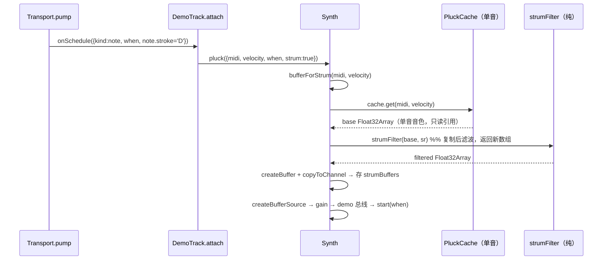
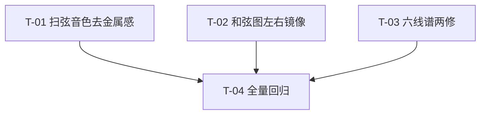

# 弦格 Fretly · 增量设计文档 v1.3（polish：1 音色优化 + 3 UI 修复）

| 项 | 内容 |
|---|---|
| 文档版本 | v1.3-polish |
| 上游 | `docs/ARCHITECTURE.md`（分层 / §6.4 音频 / §9.3·§9.7 约定 / 附翻车点自检）、`docs/ARCHITECTURE-v1.2-increment.md`（§1.2 音色增强） |
| 作者 | 高见远（架构师） |
| 范围 | ① 扫弦音色去金属感（P0）② 和弦示意图左右镜像（P0）③ 小节分割线对齐（P0）④ 扫弦音符视觉左对齐（P0） |
| 前提 | 项目已交付：`tsc` 0 错 / vitest 286 全过 / build 成功。本设计为**增量、最小变更**，复用现有函数，不重写模块。 |

> **阅读前必读**：本文所有结论基于对源码的**实际阅读**（`src/audio/synth.ts` / `src/ui/charts.tsx` / `src/core/fretboard.ts` / `src/ui/tab/tabRender.ts` / `src/core/rhythm.ts` / `src/audio/Transport.ts` / `src/types/tab.ts` / `src/types/app.ts` / `src/core/__tests__/archGuard.test.ts`），关键行号均已核对，非凭文档臆测。

---

## 0. 优先级总览（实现顺序）

| 顺序 | 改动 | 优先级 | 一句话结论 |
|:--:|---|---|---|
| Batch A | **扫弦音色去金属感** | **P0 最高（先做，独立）** | 扫弦多音同响使 2–6kHz 高频能量近线性叠加 → 金属「叮叮」。在**单音缓存之后、AudioBuffer 之前**叠一层**扫弦级 high-shelf 负增益滤波**，只软扫弦、不动单音音色、不动缓存键、不动 rake 数据。 |
| Batch B（可并行） | **和弦图左右镜像** | P0 | `ChordDiagram` 把 `parseDiagram` 的 `i=0`（1 弦）画到了最左，整体镜像。渲染层加 `5 - i` 列映射即可，**不碰 `fretboard.ts`**。 |
| Batch B（可并行） | **小节分割线对齐** | P0 | `drawTab` 的 barline `top/bottom` 少了 `stringYOf` 的 `+12` 基线偏移，导致偏上。改用 `stringYOf(row.y,1)` / `stringYOf(row.y,6)` 同源坐标。 |
| Batch B（可并行） | **扫弦音符视觉左对齐** | P0 | 渲染层把「同一次扫弦」的音符 x 归并到组首 tick（`startTick` 数据不动、rake 保留）。新增纯函数 `strumVisualTicks`，`drawTab` 与 `hitTest` 共用同一映射保证命中一致。 |
| Batch C | **全量回归** | P0 | `tsc` / vitest（286+ 新增）/ 架构守卫 / build / 手工听测 + 视觉走查。 |

---

## 1. 四改动的实现方案

### 1.1 改动一：扫弦音色去金属感（P0）

#### 1.1.1 现状与根因（对 team-lead 判断的裁定）

**根因裁定：认同「高频叠加」判断，并补充一条频域结论。**

1. **单音 KS 本身偏亮（既有事实）**：`karplus()`（`synth.ts:76`）的激励一阶低通系数 `brightness = 0.25 + velocity*0.6`（`synth.ts:212`）在中高力度下相当亮；叠加的 pick 噪声瞬态（`synth.ts:136–143`）能量集中在起音高频段。单音听感尚可，但单音的 2–6kHz 谐波与瞬态已经偏多。
2. **扫弦多音同响 → 高频能量近线性叠加（team-lead 判断，确认成立）**：扫弦一次触发 `k` 弦（`rhythm.ts` `stringsForChar`，`k` 通常 3–6），`DemoTrack`（`synth.ts:349–362`）经 `Transport.onSchedule` 对每个 note 各调一次 `synth.pluck`。这些音符的 rake 只有 1–12 tick（≈6–24ms，`rakeTicks` `rhythm.ts:29`），在听感上几乎同时发声，2–6kHz 谐波与 pick 瞬态能量叠加 → 「叮叮」金属泛音被放大。
3. **缺「扫弦音色统一性」的频域软化（补充）**：真实扫弦里，拨片逐弦「刷」过 + 琴体低通会同时做**时域涂抹**与**频域软化**。现有实现只有时域涂抹（rake 已在数据里），缺频域软化。

> **结论**：在保留单音音色（不破坏缓存、不回归 286 用例）的前提下，给**扫弦路径**叠加一层只作用于扫弦的高频衰减。这是本改动的最小且正确的切面。

#### 1.1.2 方案：扫弦级 high-shelf 负增益滤波（纯算法，后置于单音缓存）

**关键决策 —— 滤波放在哪一层、缓存怎么处理：**

| 候选 | 位置 | 结论 |
|---|---|---|
| A. 在 `karplus()` 内按扫弦/单音分支合成不同音色 | 合成层 | ❌ 破坏 `PluckCache` 按 `(midi, velocityBucket)` 的缓存键假设，且同一物理拨弦在扫弦/单音两种语境下被迫存两份。**否**。 |
| B. 在 `Synth` 调度层用 Web Audio 原生 `BiquadFilterNode` 后置 | 调度层 | ⚠️ 可行但**不可单测频响**（node 环境无 Web Audio），且偏离「纯算法合成 Float32Array」的既定原则。**不选**。 |
| **C. 在 `Synth.bufferFor` 之后，对「单音缓存的 Float32Array 副本」做纯算法滤波，再单独缓存 AudioBuffer** | 缓存层之后 | ✅ 纯算法可单测；单音缓存只读共享、键不变；扫弦滤波结果走**独立二级缓存**。**选定**。 |

**实现策略（选定 C）**：

1. 新增**纯函数** `strumFilter(buf, sampleRate): Float32Array`（`synth.ts`）：对输入**复制后**滤波，**不修改入参**（`PluckCache` 命中返回的是同一引用，绝不可原地改）。
2. `Synth` 新增 `strumBuffers: Map<string, AudioBuffer>`（与现有 `buffers` 同构但独立），新增 `bufferForStrum(midi, velocity)`：先从**共享的** `PluckCache.get(midi, velocity)` 取单音样本 → `strumFilter` 副本滤波 → `createBuffer` → 存入 `strumBuffers`。
3. `PluckOptions` 增 `strum?: boolean`；`Synth.pluck` 按 `o.strum` 选择 `bufferForStrum` 或 `bufferFor`。
4. 两条扫弦入口都打上 `strum`：
   - 播放：`DemoTrack.attach`（`synth.ts:349`）→ `strum: e.note.stroke === 'D' || e.note.stroke === 'U'`。
   - 试听：`Synth.rake`（`synth.ts:307`）→ 内部 `pluck({..., strum: true})`（rake 本来就是扫弦）。

**为什么不动缓存键、不破坏变速不变调：**
- 单音 `PluckCache` 的键 `pluckKey(midi, velocity)` 不变，命中率不变；`strumFilter` 只是消费它的输出副本。
- `strumFilter` 是**线性时不变（LTI）**、零直流、只改频谱不改基频/时值，**与 tempo 无关**；不引入采样 / AudioWorklet / `playbackRate`。变速不变调（INV-4）天然满足。
- 扫弦滤波结果用**独立缓存**，容量 = 出现过的「扫弦 (midi, 力度档)」组合（≤ 6 弦/和弦，极小），不影响单音缓存。

#### 1.1.3 关键参数与伪代码

**滤波参数（RBJ high-shelf，负增益，命名常量便于试听调参）：**

```ts
/** 扫弦级高频衰减：压制 2.5kHz 以上金属泛音（high-shelf 负增益） */
const STRUM_SHELF_FREQ = 2500;    // Hz，转角频率
const STRUM_SHELF_GAIN_DB = -5;   // dB，负值=衰减；听测偏亮可到 -7，发闷回 -3
```

**纯函数（`synth.ts`，导出可单测）：**

```ts
/** 二阶 high-shelf（RBJ）系数；gainDb 为负 → 高频衰减，只减不增，不削波 */
export function highShelfCoeffs(freq: number, gainDb: number, sr: number) {
  const A = Math.pow(10, gainDb / 40);
  const w0 = (2 * Math.PI * freq) / sr;
  const cosw0 = Math.cos(w0);
  const alpha = (Math.sin(w0) / 2) * Math.sqrt(2); // S=1 默认 shelf 斜率
  const sqA = Math.sqrt(A);
  let b0 = A * ((A + 1) + (A - 1) * cosw0 + 2 * sqA * alpha);
  let b1 = -2 * A * ((A - 1) + (A + 1) * cosw0);
  let b2 = A * ((A + 1) + (A - 1) * cosw0 - 2 * sqA * alpha);
  let a0 = (A + 1) - (A - 1) * cosw0 + 2 * sqA * alpha;
  const a1 = 2 * ((A - 1) - (A + 1) * cosw0);
  const a2 = (A + 1) - (A - 1) * cosw0 - 2 * sqA * alpha;
  return { b0: b0 / a0, b1: b1 / a0, b2: b2 / a0, a1: a1 / a0, a2: a2 / a0 };
}

/** 扫弦级高频软化：返回**新数组**，不改入参（缓存共享引用，严禁原地改） */
export function strumFilter(buf: Float32Array, sr: number): Float32Array {
  const c = highShelfCoeffs(STRUM_SHELF_FREQ, STRUM_SHELF_GAIN_DB, sr);
  const out = new Float32Array(buf.length);
  let z1 = 0, z2 = 0;
  for (let i = 0; i < buf.length; i += 1) {
    const x = buf[i];
    const y = c.b0 * x + z1;
    z1 = c.b1 * x - c.a1 * y + z2;
    z2 = c.b2 * x - c.a2 * y;
    out[i] = y;
  }
  return out;
}
```

> 备选（若实现想更简单）：一阶低通 `y += α(x−y)`，`α = 1 − exp(−2π·3200/sr)`。效果近似（2kHz≈−1dB、4kHz≈−3dB、8kHz≈−8.5dB），但不如 high-shelf 对 1–2kHz 中低频保真。**首选 high-shelf**。

**`Synth` 改动（伪代码）：**

```ts
// PluckOptions 增字段
strum?: boolean;

// Synth 新增
private readonly strumBuffers = new Map<string, AudioBuffer>();

private bufferForStrum(midi: Midi, velocity: number): AudioBuffer | null {
  const key = pluckKey(midi, velocity);
  const hit = this.strumBuffers.get(key);
  if (hit) return hit;
  const ctx = audioEngine.context;
  if (!ctx) return null;
  const base = this.cache.get(midi, velocity);          // 共享单音缓存（只读）
  const filtered = strumFilter(base, ctx.sampleRate);   // 新数组，不改 base
  const buffer = ctx.createBuffer(1, filtered.length, ctx.sampleRate);
  buffer.copyToChannel(filtered, 0);
  this.strumBuffers.set(key, buffer);
  return buffer;
}

pluck(o: PluckOptions): void {
  // ...
  const buffer = o.strum
    ? this.bufferForStrum(o.midi, o.velocity)
    : this.bufferFor(o.midi, o.velocity);
  // ...（后续 gain / start / stop 不变）
}

rake(notes): void {
  // 内部 pluck 统一加 strum: true
}

// DemoTrack.attach
this.synth.pluck({ midi, velocity, when, durationSec,
  mute: e.note.stroke === 'X',
  strum: e.note.stroke === 'D' || e.note.stroke === 'U',
});
```

**扫弦滤波调用时序：**



#### 1.1.4 衔接点（文件 + 函数 + 行号）

| 文件 | 改动 | 性质 |
|---|---|---|
| `src/audio/synth.ts` | +`highShelfCoeffs`（纯，≈`resonatorCoeffs` 旁 39–50 同风格）、+`strumFilter`（纯）；`PluckOptions`（226）增 `strum?`；`Synth`（237）增 `strumBuffers`/`bufferForStrum`；`pluck`（277–304）分支；`rake`（307–319）传 `strum:true`；`DemoTrack.attach`（349–362）按 `stroke` 传 `strum` | 纯函数（可单测）+ 副作用（Web Audio） |
| `src/audio/__tests__/strumFilter.test.ts` | 新增（频响/不削波/不改入参/不变调回归） | 测试 |
| `src/audio/__tests__/synth.test.ts` | 扩展（缓存键不变回归） | 测试 |

---

### 1.2 改动二：和弦示意图左右镜像（P0）

#### 1.2.1 根因（确认 team-lead 定位）

- `parseDiagram`（`fretboard.ts:77`）返回 `STRING_NUMBERS.map(s => ({ string: s, fret }))`，`STRING_NUMBERS = [1,2,3,4,5,6]`（`fretboard.ts:28`），故 **`positions[0]` = 1 弦（高音 E），`positions[5]` = 6 弦（低音 E）**。
- `ChordDiagram`（`charts.tsx:15`）的 `stringCol(i) = mx + i*sGap`（`charts.tsx:36`）把 `i=0` 画在 **x 最左**、`i=5` 画在最右 → 1 弦在左、6 弦在右，**整体左右镜像**。
- 弦线（44–46）、指位点（71–75）、x/o 标记（77–93）全部复用 `stringCol(i)`，因此只需改 `stringCol` 一处即可整体镜像。

#### 1.2.2 方案（纯渲染层镜像，不碰数据层/fretboard）

**正确画法**：6 弦（低音 E，最粗）在最左，1 弦（高音 E，最细）在最右。即 `positions[i]` 的 `i=0`（1 弦）→ 最右列。

**修复**：把列映射从 `i` 改为 `5 - i`，并提取为可单测的纯函数：

```tsx
// charts.tsx 模块级导出（纯函数，可单测）
/** 渲染列号：positions[i]（i=0→1弦 … i=5→6弦）→ SVG 列（0=最左）。
 *  物理方向 6弦最左/1弦最右 → col = 5 - i。
 *  ★ 纯渲染镜像，不是 `6 - x` 的弦号↔图索引换算（那类只允许在 fretboard.ts）。 */
export function chordStringColumn(i: number): number {
  return 5 - i;
}

// ChordDiagram 内
const stringCol = (i: number) => mx + chordStringColumn(i) * sGap;   // 仅此一行改动
```

弦线、指位点、x/o 标记**全部**经 `stringCol(i)`，因此这一处改动即可让三者同步镜像。外层两弦粗细 `i===0||i===5` 语义不变（仍是两外侧弦，与镜像无关）。

**守卫安全（关键）**：架构守卫 R6 的正则是 `/6\s*-\s*[A-Za-z_]/`（`archGuard.test.ts:51`）。本方案写的是 **`5 - i`**（数组下标镜像），**不是** `6 - string` 的弦号换算，**不会命中守卫**；也不直接下标 `diagram[...]`；`fretboard.ts` 的 `6-x` 唯一出口**零改动**。

#### 1.2.3 衔接点

| 文件 | 改动 | 性质 |
|---|---|---|
| `src/ui/charts.tsx` | +`chordStringColumn` 纯函数（导出）；`ChordDiagram` 的 `stringCol`（36）改用 `chordStringColumn(i)` | 纯函数 + 纯组件 |
| `src/ui/__tests__/charts.test.ts` | 新增（列序断言，关联 `parseDiagram` 约定） | 测试 |

---

### 1.3 改动三：小节分割线对齐（P0）

#### 1.3.1 根因（坐标已核算）

`drawTab`（`tabRender.ts:130`）里小节线的纵向范围与弦线**不是同源坐标**：

```ts
// tabRender.ts:137–138（当前）
const top    = row.y + HEADER_H;                          // rowY + 30
const bottom = top + STRING_GAP * (STRING_COUNT - 1);     // rowY + 30 + 75 = rowY + 105
```

而六条弦实际用 `stringYOf`（`tabRender.ts:58`）：

```ts
stringYOf(rowY, 1) = rowY + HEADER_H + 12          // = rowY + 42   ← 1弦（最上）
stringYOf(rowY, 6) = rowY + 42 + STRING_GAP*5      // = rowY + 117  ← 6弦（最下）
```

小节线绘制（`tabRender.ts:162–163`）为 `moveTo(x, top-6) → lineTo(x, bottom+4)`，即 **`[rowY+24, rowY+109]`**；弦实际跨度 **`[rowY+42, rowY+117]`**。于是：
- 起点 `rowY+24` 比 1 弦高出 **18px**（偏上）；
- 终点 `rowY+109` 比 6 弦还短 **8px**（没包住底弦）。

**根因 = `top/bottom` 漏了 `stringYOf` 里的 `+12` 基线偏移。** 左侧「谱首」起始竖线（`tabRender.ts:145–146`）用的是同一对 `top/bottom`，一并受影响。

#### 1.3.2 方案（与弦线严格同源）

把 `top/bottom` 改为直接复用 `stringYOf`（单一坐标源），并提取纯函数便于单测：

```ts
// tabRender.ts 新增（纯函数）
/** 小节线/谱首竖线的纵向范围：包住 6 条弦，上下各留边距（与 drawTab 原 -6/+4 约定一致） */
export function barlineYOf(rowY: number): { top: number; bottom: number } {
  return { top: stringYOf(rowY, 1) - 6, bottom: stringYOf(rowY, 6) + 4 };
}

// drawTab 内（替换 137–138）
const { top, bottom } = barlineYOf(row.y);   // rowY+36 … rowY+121
```

小节线（158–164）与谱首竖线（141–147）继续用 `top-6`/`bottom+4`？——**不**，`barlineYOf` 已把 `-6/+4` 边距算进返回值，绘制处改为：

```ts
ctx.moveTo(box.x + box.w, top);   // 原 top-6
ctx.lineTo(box.x + box.w, bottom);// 原 bottom+4
```

（同理，141–147 的谱首竖线用 `top`/`bottom` 直接画。）修复后竖线跨度 `[rowY+36, rowY+121]`，严格包住 6 条弦（`[rowY+42, rowY+117]`），且与 `stringYOf` 永远同源——将来若改 `HEADER_H`/`STRING_GAP`，竖线自动跟随弦线。

> 等价的最小 diff：仅把 137 行 `const top = row.y + HEADER_H;` 改成 `const top = stringYOf(row.y, 1);`、138 行 `bottom` 改成 `stringYOf(row.y, 6);`（保留原 `top-6/bottom+4`）。两者效果一致；上文 `barlineYOf` 额外提供可单测的纯函数，**推荐后者**。

#### 1.3.3 衔接点

| 文件 | 改动 | 性质 |
|---|---|---|
| `src/ui/tab/tabRender.ts` | +`barlineYOf` 纯函数；`drawTab`（130）的 `top/bottom`（137–138）改用 `barlineYOf(row.y)`，谱首竖线（141–147）与右小节线（158–164）改用返回的 `top/bottom` | 纯函数 + 副作用（canvas） |
| `src/ui/tab/__tests__/tabRender.test.ts` | 新增（坐标范围断言） | 测试 |

---

### 1.4 改动四：扫弦音符视觉左对齐（P0）

#### 1.4.1 根因（确认）

- `expandPattern`（`rhythm.ts:149`）给同一次扫弦的 `k` 个音符设 `startTick = slotStart + i * rake`（`i=0..k-1`）。
- `drawTab`（`tabRender.ts:219`）用 `contentXOf(box, measure.ticks, note.startTick)` 映射 x，于是同一扫弦的音符依次右移 `rake` 个 tick，视觉呈阶梯状错位。
- `hitTest`（`tabRender.ts:100`）同样用 `note.startTick` 算 x 距离。

**目标（用户确认）**：视觉对齐、音频保留 rake。即 `startTick` 数据**不动**（rake 颗粒感保留），只在渲染层把同一次扫弦的音符 x 归并到组首（左对齐到 slot 起点）。

#### 1.4.2 方案（渲染层分组归并，drawTab/hitTest 共用同一映射）

**识别「同一次扫弦」的规则**（纯函数，稳健、与 bpm 解耦）：

> 按 `startTick` 升序扫描；`stroke ∈ {D, U}` 且与前一音符同 stroke、且 `startTick` 间隔 `≤ STRUM_GROUP_GAP_TICKS` 的连续音符属于同一扫弦组；组视觉 tick = 组内最小 `startTick`。

`STRUM_GROUP_GAP_TICKS = 12`，取值依据：`rakeTicks`（`rhythm.ts:30`）clamp 上界即 **12**，故组内间隔恒 `≤ 12`；相邻两 slot 的间隔 = `slotTicks ≥ 240`（内置模板 6–8 slot，`rhythmPatterns.ts`），远大于 12，绝不会误并。用常量而非 `rakeTicks(bpm)`，使渲染层与 tempo 彻底解耦（与「合成参数与 tempo 无关」哲学一致）。

```ts
// tabRender.ts 新增（纯函数）
/** rakeTicks 的 clamp 上界（rhythm.ts:30），组内间隔 ≤ 该值、组间间隔 ≥ slotTicks ≫ 该值 */
export const STRUM_GROUP_GAP_TICKS = 12;

/**
 * 纯：把同一次扫弦（stroke∈{D,U} 且相邻 startTick 间隔 ≤ STRUM_GROUP_GAP_TICKS）
 * 归并到组首 tick，返回 noteId → 视觉 tick。数据层 note.startTick 不变，仅影响渲染/命中 x。
 */
export function strumVisualTicks(notes: Note[]): Map<NoteId, Tick> {
  const out = new Map<NoteId, Tick>();
  const sorted = [...notes].sort((a, b) => a.startTick - b.startTick || a.string - b.string);
  let groupStart = 0;
  let groupStroke: Stroke | null = null;
  for (let i = 0; i < sorted.length; i += 1) {
    const n = sorted[i];
    const isStrum = n.stroke === 'D' || n.stroke === 'U';
    const sameGroup =
      i > 0 &&
      isStrum &&
      n.stroke === groupStroke &&
      n.startTick - sorted[i - 1].startTick <= STRUM_GROUP_GAP_TICKS;
    if (!sameGroup) {
      groupStart = n.startTick;
      groupStroke = isStrum ? n.stroke : null;
    }
    out.set(n.id, groupStart);
  }
  return out;
}
```

**渲染接入（`drawTab`）**——每个小节算一次，音符 x 用视觉 tick：

```ts
// drawTab 内，measure.notes 循环前
const visTicks = strumVisualTicks(measure.notes);
for (const note of measure.notes) {
  const visualTick = visTicks.get(note.id) ?? note.startTick;
  const nx = contentXOf(box, measure.ticks, visualTick);   // 替代原 note.startTick
  // ...（ny / 指法 / 技法 均不变）
}
```

**命中接入（`hitTest`）——与渲染同一映射，保证一致性（关键降险点）**：

```ts
// hitTest 内，命中小节 m 确定后
const visTicks = strumVisualTicks(m.notes);
for (const n of m.notes) {
  const visualTick = visTicks.get(n.id) ?? n.startTick;
  const nx = contentXOf(measure, m.ticks, visualTick);      // 与 drawTab 完全同源
  const ny = stringYOf(measure.y, n.string);                // y 仍按弦，不归并
  // ... 距离判断不变
}
```

**命中一致性原理**：视觉左对齐只改 x、不改 y（各弦 `ny = stringYOf(...n.string)` 仍独立）。同组多音在**同一 x、不同 y**，用户点击对齐列时，`hitTest` 的 `<15px` 距离判定由 **y** 决定选中哪根弦——因此左对齐后命中**反而更准**（点的位置就是画的位置）。前提是 `drawTab` 与 `hitTest` **共用同一个 `strumVisualTicks`**（单一纯函数源），不允许各自实现一份。

**不动的东西**：`rhythm.ts` 数据生成零改动；`tickToGlobalX`（播放头/循环区，`TabCanvas.tsx:180`）走的是「全局 tick → x」的线性映射，与音符无关，**不受影响**，播放头仍按真实 tick 扫过（音频与播放头同步，视觉与音频的差异仅限扫弦列的横向对齐，符合用户「视觉对齐、音频保留 rake」的意图）。

#### 1.4.3 衔接点

| 文件 | 改动 | 性质 |
|---|---|---|
| `src/ui/tab/tabRender.ts` | +`STRUM_GROUP_GAP_TICKS`、+`strumVisualTicks`（纯）；`drawTab`（218–257）音符 x 用视觉 tick；`hitTest`（91–109）音符 x 用同一映射 | 纯函数 + 副作用（canvas）+ 纯命中 |
| `src/ui/tab/__tests__/tabRender.test.ts` | 新增（分组纯逻辑 + x 一致性断言） | 测试 |

---

## 2. 文件清单（新增 / 修改）

| 路径（相对 `fretly/`） | 新增/修改 | 职责 | 预估行数 | 性质 |
|---|---|:--:|---|
| `src/audio/synth.ts` | 修改 | +`highShelfCoeffs`/`strumFilter` 纯函数；`PluckOptions.strum`；`Synth.strumBuffers`/`bufferForStrum`；`pluck`/`rake` 分支；`DemoTrack` 按 stroke 传 strum | +~45 | `strumFilter` 纯函数；其余 Web Audio 副作用 |
| `src/audio/__tests__/strumFilter.test.ts` | 新增 | 频响（高频衰减/低频保持）、不削波、不改入参、变速不变调回归 | ~60 | 纯测试 |
| `src/audio/__tests__/synth.test.ts` | 修改 | 补「缓存键不变」回归（`pluckKey` 仍 `midi:bucket`） | +~6 | 纯测试 |
| `src/ui/charts.tsx` | 修改 | +`chordStringColumn` 纯函数；`ChordDiagram.stringCol` 镜像 | +~4 | 纯函数/纯组件 |
| `src/ui/__tests__/charts.test.ts` | 新增 | 列序镜像断言（关联 `parseDiagram` 约定） | ~30 | 纯测试 |
| `src/ui/tab/tabRender.ts` | 修改 | +`barlineYOf`；`drawTab` 竖线对齐；+`STRUM_GROUP_GAP_TICKS`/`strumVisualTicks`；`drawTab`/`hitTest` 用视觉 tick | +~40 | `barlineYOf`/`strumVisualTicks` 纯函数；`drawTab` 副作用；`hitTest` 纯 |
| `src/ui/tab/__tests__/tabRender.test.ts` | 新增 | 分割线坐标范围、扫弦分组、drawTab/hitTest 同源断言 | ~80 | 纯测试 |

**说明**：这是对已交付项目的最小 polish 增量，每个改动 =「1 处源码 + 1–2 个测试文件」，不新增 infra、不重写模块。通用模板里的「首任务必为项目基础设施 / 每任务 ≥3 文件」是针对**从零新模块**的约束；对本次「最小变更」若强行凑文件反而违背「不重写、最小变更」硬性要求，故以**关切聚类**划分任务（见 §3）。

---

## 3. 任务列表（有序、依赖、按实现顺序）

> 格式：`T-xx | 依赖 | 文件 | 说明 | 验收`。Batch A 音色先做；Batch B 三项 UI 修复相互独立、可并行；Batch C 全量回归收口。

### Batch A · 音色（P0，先行）

**T-01 | 无 | `src/audio/synth.ts`（改）、`src/audio/__tests__/strumFilter.test.ts`（新）、`src/audio/__tests__/synth.test.ts`（改） | 扫弦音色去金属感：新增 `highShelfCoeffs`/`strumFilter` 纯函数；`Synth` 加独立 `strumBuffers`/`bufferForStrum`；`PluckOptions.strum`；`pluck`/`rake` 分支；`DemoTrack` 按 `stroke∈{D,U}` 传 `strum` | `strumFilter` 频响正确（2.5kHz 以上衰减、1kHz 保持）；不削波（负增益只减不增）；入参不被原地改；`pluckKey` 键不变、单音命中率不降；变速不变调（无 playbackRate/无采样/架构守卫通过）**

### Batch B · UI 三修（P0，三者互不依赖，可并行）

**T-02 | 无（与 T-01/T-03 并行） | `src/ui/charts.tsx`（改）、`src/ui/__tests__/charts.test.ts`（新） | 和弦图左右镜像：导出 `chordStringColumn(i)=5-i`，`ChordDiagram.stringCol` 改用它；弦线/指位点/x·o 同步镜像 | 列序断言 `col[0](1弦)=最右(5)`、`col[5](6弦)=最左(0)`、单调递减；不碰 `fretboard.ts`；archGuard R6 通过（无新增 `6 - x`）**

**T-03 | 无（与 T-01/T-02 并行） | `src/ui/tab/tabRender.ts`（改）、`src/ui/tab/__tests__/tabRender.test.ts`（新） | 六线谱两修：① 新增 `barlineYOf` 并用 `stringYOf(row.y,1/6)` 对齐小节线；② 新增 `STRUM_GROUP_GAP_TICKS`/`strumVisualTicks`，`drawTab` 与 `hitTest` 统一用视觉 tick 左对齐扫弦 | ① `barlineYOf(0)={top:36,bottom:121}` 且包住 6 弦；② 分组纯逻辑：同组归并、不同 slot/不同 stroke/P 音不并、单音不变；③ `drawTab` 与 `hitTest` 同源（点对齐列能选中正确弦）**

### Batch C · 全量回归（P0，收口）

**T-04 | T-01, T-02, T-03 | 上述 7 文件（回归校验，无新逻辑） | 全量回归：`npm run typecheck` 0 错、`npm test`（286 + 新增）全过、架构守卫通过、`npm run build` 成功；手工听测（扫弦不刺耳、变速不变调、单音音色无变化）与视觉走查（和弦图方向、分割线对齐、扫弦列整齐） | 全绿 + 人工确认四项修复达成、无回归**

---

## 4. 风险与降险

### 4.1 扫弦滤波如何不破坏 PluckCache / 变速不变调
- **不破坏缓存**：`strumFilter` 消费 `PluckCache.get()` 的**只读副本**（返回新数组，绝不原地改，入参共享引用这一风险点由 `strumFilter` 的「copy-then-filter」实现 + 单测「入参不被改」双重兜底）；单音 `pluckKey` 键不变；扫弦滤波结果走**独立 `strumBuffers`**，容量仅「扫弦出现的 (midi, 力度档)」组合（≤6/和弦）。
- **不破坏变速不变调**：`strumFilter` 是 LTI、零直流、只改频谱不改基频/时值、与 tempo 无关；合成仍为纯 `Float32Array`，无采样/无 `AudioWorklet`/无 `playbackRate`（INV-4、架构守卫回归覆盖）。
- **不破坏单音音色**：滤波仅作用于 `stroke∈{D,U}`（播放）与 `Synth.rake`（试听）；`stroke=P/null/X` 的单音/分解/闷音仍走 `bufferFor`，286 既有单音用例零回归。

### 4.2 和弦图镜像如何不碰 fretboard 的 `6-x` 唯一出口约定
- 只改渲染层 `charts.tsx` 的 `stringCol`；写 **`5 - i`**（数组下标 → 列号的纯渲染镜像），**不是** `6 - string` 的弦号↔图索引换算。
- 架构守卫 R6 正则 `/6\s*-\s*[A-Za-z_]/`（`archGuard.test.ts:51`）只拦 `6 - <标识符>`；`5 - i` 不命中；也不新增 `diagram[...]` 直接下标。
- `fretboard.ts` 的 `diagramIndexOf`/`stringOf`/`parseDiagram` **零改动**，数据约定（`positions[0]=1弦`）保持不变。

### 4.3 扫弦视觉对齐如何不破坏 hitTest 命中
- **单一映射源**：`strumVisualTicks` 是唯一的分组函数，`drawTab` 与 `hitTest` **共用**，禁止各自内联一份。
- **只改 x、不动 y**：命中仍由 `ny = stringYOf(...n.string)` 决定选中哪根弦；左对齐后「点的位置 = 画的位置」，命中精度反而提升。
- **不并入非扫弦**：分组要求 `stroke∈{D,U}`，`P`（分解）与 `null`（单音）音符不被归并，各自保持真实 `startTick`。
- **播放头不受影响**：`tickToGlobalX`（播放头/循环区）走线性 tick→x，与音符无关，不与视觉对齐耦合。

---

## 5. 测试计划（每改动补什么单测）

### 5.1 音色（`src/audio/__tests__/strumFilter.test.ts` 新增 + `synth.test.ts` 扩展）
- **频响（扫弦高频衰减）**：分别合成 1kHz（通带）与 6kHz（阻带）正弦，`strumFilter` 后断言 6kHz RMS 下降 ≥ 3dB、1kHz RMS 变化 < ±10%（high-shelf 只削高频）。
- **不削波**：对 velocity=1 的单音样本做 `strumFilter`，断言 `max|out| ≤ max|in| + ε`（负增益 shelf 只减不增）。
- **不改入参（缓存安全）**：传入 `PluckCache.get()` 命中的同一引用，断言 `strumFilter` 返回**新数组**且原数组逐样本不变。
- **变速不变调回归**：`strumFilter` 输出长度 = 输入长度（无重采样）；对 440Hz 正弦滤波后过零率不显著偏移（LTI 不改基频）。
- **缓存键回归（`synth.test.ts`）**：`pluckKey(64, 0.85)` 仍为 `'64:0.75'`；单音 `PluckCache` hit/miss 计数不受 strum 路径影响。

### 5.2 和弦图镜像（`src/ui/__tests__/charts.test.ts` 新增）
- `chordStringColumn(0) === 5`（1 弦最右）、`chordStringColumn(5) === 0`（6 弦最左）、对 `i=0..4` 单调递减。
- 关联约定：`parseDiagram('x32010')` 的 `positions[0].string===1`、`positions[5].string===6`，再断言其列号落到最右/最左——把渲染镜像与数据方向绑定成回归防波堤。

### 5.3 分割线 + 扫弦对齐（`src/ui/tab/__tests__/tabRender.test.ts` 新增）
- **分割线坐标范围**：`barlineYOf(0)` 恒等于 `{ top: 36, bottom: 121 }`；断言 `top < stringYOf(0,1) < stringYOf(0,6) < bottom`（竖线包住 6 弦，且与 `stringYOf` 同源）。
- **扫弦分组纯逻辑**：构造 `D` 扫弦 3 音（startTick 100/103/106）+ `P` 单音（200）+ `U` 扫弦 2 音（300/304），断言三组分别归并到 100/200/300；再验「相邻同 stroke 但间隔 >12 tick」被拆成两组、单音不变、`P`/`null` 不并入。
- **drawTab/hitTest 同源**：用最小 `Tab` fixture 构造扫弦小节，断言 `strumVisualTicks` 得出的组首 tick 经 `contentXOf` 映射后，`hitTest` 在该 x、各弦 y 处能命中**正确弦**（y 决定选弦，不因左对齐错位）。

---

## 附：任务依赖图


