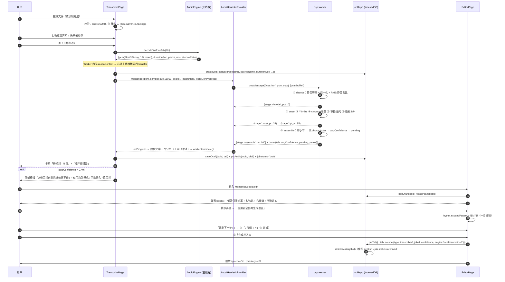
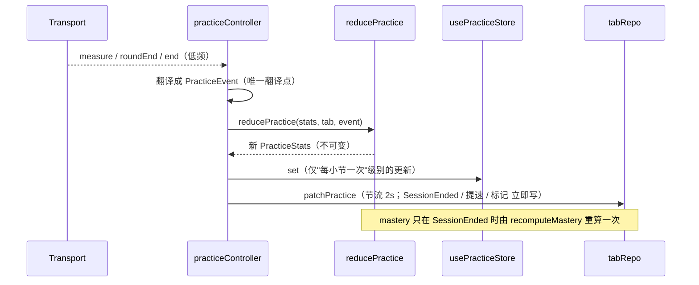
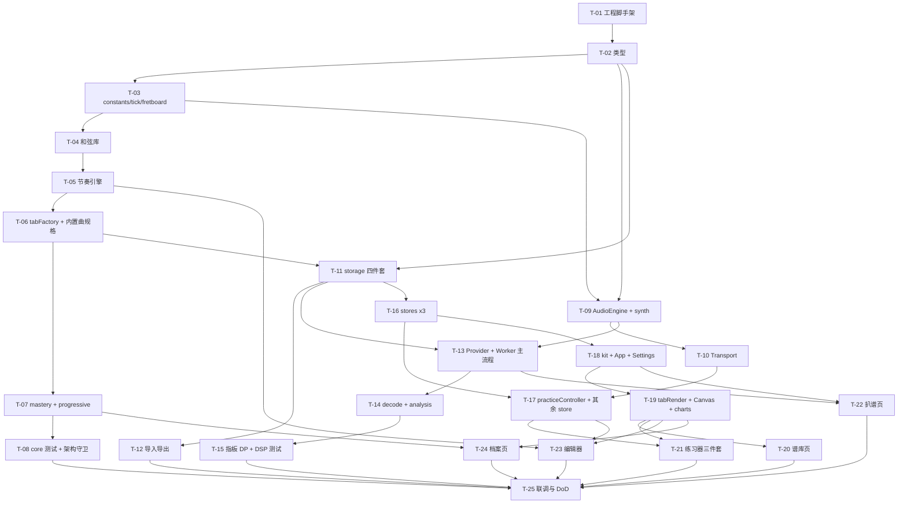

# 弦格 Fretly · 系统架构设计文档（M1）

| 项 | 内容 |
|---|---|
| 文档版本 | v1.0 |
| 作者 | 高见远（架构师） |
| 日期 | 2026-09-08 |
| 上游 | `docs/PRD-increment-v1.1.md`（需求基线）、`Fretly_PRD.html`（v1.0 背景） |
| 适用里程碑 | M1 |
| 形态 | 纯前端静态站点，零后端，断网可用 |
| 文件总数 | **61 个**（工程配置 5 + 源码 51 + 测试 5） |

> **本文档是工程师的唯一施工图**。任务列表（§8）到"一个文件 / 一组文件"粒度，照序实现即可完成 M1。
> 三个历史翻车点的结构性防御分别在：**§6（Transport 单一时间源 / 禁 playbackRate）**、**§4.3 + §9.2（diagram↔string 唯一转换 + 架构守卫测试）**、**§4.6 + §5.2（领域事件流 + 唯一重算点）**。

---

## 1. 实现方案与框架选型

### 1.1 核心技术挑战与对策

| # | 挑战 | 对策 | 落点 |
|:--:|---|---|---|
| C1 | **变速必须保音高** | 禁用 `playbackRate`。以 tick 为唯一音乐时间轴，Transport 持有「tick→AudioContext 时间」的分段锚点映射；变速只改映射斜率，合成参数（基频、衰减）完全不变 → 天然保音高 | `src/audio/Transport.ts` |
| C2 | **提速不能爆音/不能重渲染** | 预调度 `lookahead=0.1s` + `setInterval 25ms`；已 `start(when)` 的音符不撤销；tempo 变更在**下一小节线**写入新锚点。React 渲染与 25ms 调度彻底解耦：rAF 直读 `transport.currentTick` 画播放头，仅"跨小节/BPM 变化"这类低频事件才 `setState` | `Transport.ts` + `src/ui/tab/TabCanvas.tsx` + `src/ui/kit.tsx` |
| C3 | **方向相反易错** | 全项目**只有** `core/fretboard.ts` 允许出现 `6 - x`；对外只暴露 `diagramIndexOf(string)` / `stringOf(index)` / `fretAt()` / `soundedStrings()`。并写"架构守卫测试"扫描源码 | `src/core/fretboard.ts`、`core.test.ts` |
| C4 | **熟练度数据流为空** | 定义领域事件 `RoundCompleted / RoundPassed / TempoRaised / MeasureCovered / SessionEnded`，由**唯一编排器** `practiceController` 派发，交给**纯 reducer** `reducePractice`；熟练度**只在 SessionEnded 时重算一次** | `src/core/progressive.ts`、`src/state/practiceController.ts` |
| C5 | **零采样体积的吉他音色** | Karplus-Strong 拨弦物理建模：白噪声激励 + 延迟线 + 一阶低通反馈。纯函数产出 `Float32Array` → `AudioBuffer`，按 `(midi, 力度档)` 缓存复用 | `src/audio/synth.ts` |
| C6 | **本地扒谱（无 GPU/无后端）** | 主线程解码（Worker 内无 `AudioContext`）→ 把 16k mono `Float32Array` **transfer** 给 Worker → 7 阶段纯 DSP → 带 confidence 的 Tab JSON | `src/audio/AudioEngine.ts` + `src/transcribe/*` |
| C7 | **48 小节谱面渲染性能** | 双 Canvas：静态谱面层（仅在数据/视图/循环变化时重绘）+ 播放头 overlay 层（rAF 局部重绘）；只渲染可视区 ±2 小节 | `src/ui/tab/tabRender.ts`、`TabCanvas.tsx` |
| C8 | **纯前端 + 断网可用** | 无 fetch/XHR；localStorage（索引/设置）+ IndexedDB（谱面/音频/草稿/会话/任务/歌单） | `src/storage/*` |
| C9 | **合规** | 内置曲只存"紧凑规格"，首次启动由生成器展开；全站文案常量集中，禁止"额度/剩余次数" | `src/data/builtinSongs.ts`、`src/core/constants.ts` |

### 1.2 技术栈与依赖清单（尽量精简）

**dependencies（5 个）**

```jsonc
{
  "react": "^18.3.1",              // UI
  "react-dom": "^18.3.1",
  "react-router-dom": "^6.28.0",   // 路由（v6，BrowserRouter；静态托管需 fallback 到 index.html）
  "zustand": "^4.5.5",             // 全局状态（轻量，无 Provider 嵌套）
  "idb": "^8.0.0"                  // IndexedDB Promise 封装（约 2KB，比手写事件封装省 200 行）
}
```

**devDependencies（11 个）**

```jsonc
{
  "vite": "^5.4.10",                  // 构建
  "@vitejs/plugin-react": "^4.3.4",
  "typescript": "^5.6.3",
  "tailwindcss": "^4.1.11",           // Tailwind v4：CSS-first，无 tailwind.config.js
  "@tailwindcss/vite": "^4.1.11",     // Vite 插件
  "vitest": "^2.1.8",                 // 单测（配置并入 vite.config.ts）
  "jsdom": "^25.0.1",                 // 组件测试可选，先备着
  "@types/react": "^18.3.12",
  "@types/react-dom": "^18.3.1",
  "@types/node": "^22.9.0"            // vite.config.ts 需要
}
```

**明确不引入**：MUI / 任何 UI 组件库（全部手写）、Redux、Tailwind v3 + postcss/autoprefixer（v4 由插件接管）、`date-fns`（`constants.ts` 里 30 行够用）、`zod`（手写 `validate.ts` 约 60 行）、`ulid` 包（自实现 25 行）、`clsx`（自写 `cx()`）、`comlink`（Worker 消息手写约 40 行）、任何音频文件。

### 1.3 架构模式

- **分层 + 依赖倒置**：`ui → state → (core | audio | storage | io | transcribe)`；`core` 是纯函数层，**不依赖 React / Web Audio / IndexedDB**。
- **端口与适配器**：`TranscriptionProvider`（扒谱）、`TabImporter`（导入）、`TabRepository`（持久化）皆为接口，实现可替换。
- **事件驱动 + 单一编排器**：UI 只发"意图"，`practiceController` 翻译成领域事件，纯 reducer 落库。
- **订阅而非 State 驱动的高频渲染**：Transport → rAF/回调，不进 React 状态。

---

## 2. 目录结构与完整文件清单

```
fretly/
├── package.json / vite.config.ts / tsconfig.json / index.html / .gitignore
└── src/
    ├── main.tsx  App.tsx  styles/index.css
    ├── types/       tab.ts  app.ts
    ├── core/        constants  tick  fretboard  chords  rhythm  tabFactory  mastery  progressive
    ├── data/        chords  rhythmPatterns  builtinSongs
    ├── audio/       AudioEngine  Transport  synth
    ├── transcribe/  provider  LocalHeuristicProvider  worker/{dsp.worker,decode,analysis,fretboardDP}
    ├── storage/     db  tabRepo  jobRepo  seed
    ├── io/          importers  musicXmlImporter  exporters
    ├── state/       useAppStore  useLibraryStore  usePracticeStore  useTranscribeStore  useEditorStore  practiceController
    └── ui/          kit.tsx  charts.tsx  tab/{tabRender,TabCanvas}  library/LibraryPage  practice/{PracticePage,PracticeToolbar,ProgressivePanel}  transcribe/TranscribePage  editor/{EditorPage,EditorPanels}  dashboard/DashboardPage  settings/SettingsPage
```

> **标记说明**：`[纯]` = 纯函数、易单测；`[副]` = 有副作用（AudioContext / IndexedDB / DOM / Worker），测试需 mock 或跳过；`[混]` = 以纯函数为主、壳层有副作用。

### 2.1 工程配置与入口（8 个）

| # | 文件 | 职责 | 行数 | 性质 |
|:--:|---|--:|:--:|:--:|
| 1 | `package.json` | 依赖与脚本：`dev` / `build` / `preview` / `test` / `typecheck` | 40 | — |
| 2 | `vite.config.ts` | React 插件 + `@tailwindcss/vite` + `test` 段（vitest, environment: node, jsdom 仅组件测试） | 35 | — |
| 3 | `tsconfig.json` | `strict: true`、`paths: {"@/*": ["src/*"]}`、`types: ["vite/client","node"]` | 30 | — |
| 4 | `index.html` | 挂载点 + `<meta viewport>` + 中文 lang | 15 | — |
| 5 | `.gitignore` | node_modules / dist / .DS_Store | 10 | — |
| 6 | `src/main.tsx` | createRoot + RouterProvider + 全局错误边界 | 30 | `[副]` |
| 7 | `src/App.tsx` | 路由表 + AppShell（顶栏/导航/合规声明/不支持页/窄屏提示/Toast Host） | 260 | `[副]` |
| 8 | `src/styles/index.css` | `@import "tailwindcss"` + `@theme` 设计令牌 + 滚动条 + `@media print` 打印样式 | 180 | — |

### 2.2 类型（2 个）

| # | 文件 | 职责 | 行数 | 性质 |
|:--:|---|--:|:--:|:--:|
| 9 | `src/types/tab.ts` | Tab / Track / Measure / Note / ChordEvent / Marker / PracticeStats / 枚举与字面量类型 | 180 | `[纯]` |
| 10 | `src/types/app.ts` | PracticeSession / Collection / TranscriptionJob / Settings / TranscriptionResult / PendingItem / Worker 消息协议 / 服务接口 | 200 | `[纯]` |

### 2.3 core 纯逻辑（8 个）

| # | 文件 | 职责 | 行数 | 性质 |
|:--:|---|--:|:--:|:--:|
| 11 | `src/core/constants.ts` | `TICKS_PER_BEAT=480`、`LOOKAHEAD=0.1`、`SCHEDULER_MS=25`、限值与边界常量、**ULID 生成**、日期助手（ISO/相对时间/自然日）、`clamp/round2/cx` | 150 | `[纯]` |
| 12 | `src/core/tick.ts` | tick↔秒、小节 tick 计算、`tickToMeasure`、`measureStartTick`、**A-B 循环跳转目标**、拍/小节线枚举 | 110 | `[纯]` |
| 13 | `src/core/fretboard.ts` | ★**唯一** `diagramIndexOf/stringOf/fretAt/soundedStrings`；音名↔MIDI、`fretToMidi`、标准调弦、指板全位置枚举 | 130 | `[纯]` |
| 14 | `src/core/chords.ts` | 和弦库查询、`parseDiagram`、`isBarre`、横按降级表、chroma 向量、**候选和弦排序**（Top8 / 低置信候选 Top3） | 180 | `[纯]` |
| 15 | `src/core/rhythm.ts` | ★§7.3 节奏引擎：`slotTicks()`、`expandPattern()` → `(弦,方向,velocity,stroke)` 序列、rake 计算、边界压缩 | 200 | `[纯]` |
| 16 | `src/core/tabFactory.ts` | ★`buildTabFromChordChart()`、`createEmptyTab()`、`cloneTab()`、`computeDifficulty()`、`validateTab()`、`regenerateMeasure()` | 280 | `[纯]` |
| 17 | `src/core/mastery.ts` | 熟练度四因子（S/C/A/F）、新鲜度分段、EMA 平滑、**会话/打卡/指标卡聚合**（streak、本周时长、在练曲目、平均速度） | 190 | `[纯]` |
| 18 | `src/core/progressive.ts` | ★领域事件定义 + `reducePractice(stats, tab, event)` 纯 reducer + 渐进加速状态机（`startBpm/step/consecutive/提速判定`） | 220 | `[纯]` |

### 2.4 静态数据（3 个）

| # | 文件 | 职责 | 行数 | 性质 |
|:--:|---|--:|:--:|:--:|
| 19 | `src/data/chords.ts` | 24 个和弦指位（§7.4）+ `barre` 标记 + 降级表（§7.5）+ 12 维 chroma 模板 | 160 | `[纯]` |
| 20 | `src/data/rhythmPatterns.ts` | 12 个节奏型模板（§7.2） | 90 | `[纯]` |
| 21 | `src/data/builtinSongs.ts` | 4 首示范曲**紧凑规格**（和弦进行 + 节奏型 id + 元数据），非完整 JSON | 120 | `[纯]` |

### 2.5 audio（3 个，全部副作用）

| # | 文件 | 职责 | 行数 | 性质 |
|:--:|---|--:|:--:|:--:|
| 22 | `src/audio/AudioEngine.ts` | AudioContext 单例、总线（master/metronome/demo）、`resume()`、能力检测、`decodeToMono16k()`（重采样+归一化+RMS+peaks）、`recordMic()` | 300 | `[副]` |
| 23 | `src/audio/Transport.ts` | ★**唯一时间与 tempo 真相源**：锚点映射、`setInterval(25ms)` 调度器、`lookahead=0.1s`、`setTempo(下一小节线生效)`、`onSchedule/onBoundary` 订阅、A-B 循环 | 320 | `[副]` |
| 24 | `src/audio/synth.ts` | Karplus-Strong 纯算法 `karplus()` + `AudioBuffer` 缓存 + `Synth.pluck()`；`Metronome` 与 `DemoTrack`（均订阅 `Transport.onSchedule`） | 340 | `[混]` |

### 2.6 transcribe（6 个）

| # | 文件 | 职责 | 行数 | 性质 |
|:--:|---|--:|:--:|:--:|
| 25 | `src/transcribe/provider.ts` | `TranscriptionProvider` 接口 + 消息协议类型 + `RemoteProvider` 空壳（`enabled=false`）+ 注册表 | 110 | `[纯]` |
| 26 | `src/transcribe/LocalHeuristicProvider.ts` | 创建/复用 Worker、进度转发、`cancel() → worker.terminate()`、超时保护 | 120 | `[副]` |
| 27 | `src/transcribe/worker/dsp.worker.ts` | Worker 入口：消息循环、7 阶段编排与进度上报、**结果组装**（`assembleTab()`，含 pending 清单与 avgConfidence） | 260 | `[混]` |
| 28 | `src/transcribe/worker/decode.ts` | 静音切除、响度归一化、RMS/静音占比质量预判、`peaks` 抽取 | 120 | `[纯]` |
| 29 | `src/transcribe/worker/analysis.ts` | 能量 onset 检测 + YIN-lite 音高 + 12 维 chroma 与和弦模板 Viterbi + 节拍/拍号估计 | 380 | `[纯]` |
| 30 | `src/transcribe/worker/fretboardDP.ts` | 指板 Viterbi 映射：候选生成、发射/转移代价、硬约束、Top-3 候选输出 | 300 | `[纯]` |

### 2.7 storage（4 个）

| # | 文件 | 职责 | 行数 | 性质 |
|:--:|---|--:|:--:|:--:|
| 31 | `src/storage/db.ts` | `idb` 打开/升级（6 stores + 索引）、通用 CRUD、`localStorage` 封装（前缀 `fretly.`）、**Settings 读写与订阅** | 220 | `[副]` |
| 32 | `src/storage/tabRepo.ts` | `TabRepository`：tabs CRUD（revision+1）、`patchPractice`、歌单 CRUD、sessions 读写与聚合查询 | 240 | `[副]` |
| 33 | `src/storage/jobRepo.ts` | jobs / drafts / audios 生命周期：创建、进度、草稿自动保存、入库后**删除音频 Blob 保留 peaks**、淘汰策略（草稿 20 / 音频 10） | 200 | `[副]` |
| 34 | `src/storage/seed.ts` | 首次播种 4 首（调 `buildTabFromChordChart`）、`fretly.seeded` 标记、**全量导出 JSON** 与**清空本地数据** | 150 | `[副]` |

### 2.8 io（4 个，含 1 测试）

| # | 文件 | 职责 | 行数 | 性质 |
|:--:|---|--:|:--:|:--:|
| 35 | `src/io/importers.ts` | `TabImporter` 接口 + `jsonImporter` + `asciiImporter`（宽松解析）+ `gpImporter` 占位（抛 `NotImplementedError`）+ 注册表 + `ImportResult{partial, failedAt, reason}` | 340 | `[纯]` |
| 36 | `src/io/musicXmlImporter.ts` | MusicXML：只取 6 弦标准调吉他轨、忽略打击乐、反复线性展开、多声部取最低品位 | 260 | `[纯]` |
| 37 | `src/io/exporters.ts` | JSON 导出（往返无损）、ASCII 导出、PDF（注入 `@media print` 类 + `window.print()`） | 180 | `[混]` |
| 38 | `src/io/__tests__/io.test.ts` | JSON 往返无损、ASCII 宽松解析、MusicXML 单轨、失败部分保留 | 150 | `[纯]` |

### 2.9 state（6 个）

| # | 文件 | 职责 | 行数 | 性质 |
|:--:|---|--:|:--:|:--:|
| 39 | `src/state/useAppStore.ts` | Settings + UI 偏好（`libraryView`、筛选态）+ Toast 队列 + `seeded/disclaimerAcked` | 120 | `[副]` |
| 40 | `src/state/useLibraryStore.ts` | 曲目索引、搜索/筛选/排序（纯计算在 selector）、歌单、导入导出动作 | 220 | `[副]` |
| 41 | `src/state/usePracticeStore.ts` | 练习器 UI 态：ratio、循环区、视图、标记、会话计时显示、渐进加速参数与轮次柱状图 | 200 | `[副]` |
| 42 | `src/state/useTranscribeStore.ts` | 任务列表、上传/录制状态、推理进度、取消 | 160 | `[副]` |
| 43 | `src/state/useEditorStore.ts` | 草稿 Tab、选区、撤销/重做命令栈（≥50 步）、待确认清单与确认动作、自动保存 | 260 | `[副]` |
| 44 | `src/state/practiceController.ts` | ★**唯一编排器**：订阅 Transport 时钟事件 → 派发领域事件 → `reducePractice` → 节流落库；会话开始/结束判定 | 280 | `[副]` |

### 2.10 ui（13 个）

| # | 文件 | 职责 | 行数 | 性质 |
|:--:|---|--:|:--:|:--:|
| 45 | `src/ui/kit.tsx` | 手写基础件：Button/IconButton/Slider/Select/Checkbox/Modal/Confirm/Toast/Progress/Star/Badge/Skeleton/EmptyState/**hooks**（`usePlayheadTick` rAF、`useDebounce`、`useHotkeys`、`useRaf`） | 380 | `[副]` |
| 46 | `src/ui/tab/tabRender.ts` | 六线谱**布局计算**（纯）+ Canvas **绘制**（纯，接收 ctx）+ **命中测试**（纯）：坐标↔(小节,tick,弦,音符) | 420 | `[纯]` |
| 47 | `src/ui/tab/TabCanvas.tsx` | 双 Canvas 组件（静态层 + 播放头 overlay）、rAF 循环、滚动与可视区裁剪、点击/框选/拖弦交互 | 300 | `[副]` |
| 48 | `src/ui/charts.tsx` | 速度柱状图、速度折线图、打卡日历、**和弦指位图**（SVG：6 弦×5 品、`x/o`、横按弧线、根音高亮） | 300 | `[纯]` |
| 49 | `src/ui/library/LibraryPage.tsx` | 谱库页 + 歌单侧栏 + 搜索/四维筛选/排序 + 卡片与空态 + 导入弹窗 + `/tab/:id` 详情编辑（元信息/导出/重置练习数据） | 560 | `[副]` |
| 50 | `src/ui/practice/PracticePage.tsx` | 练习器装配：视图切换、右栏（和弦预告/简易替代/难点标记/计时）、快捷键 | 380 | `[副]` |
| 51 | `src/ui/practice/PracticeToolbar.tsx` | 播放控制、变速滑块+当前 BPM、A-B 循环、节拍器（拍号/subdivision/预备拍）、示范音轨音量、点击试听 | 280 | `[副]` |
| 52 | `src/ui/practice/ProgressivePanel.tsx` | ★常驻面板：四参数 + 开始/暂停 +「本轮过了」+ 连续达标 + 柱状图 + 达成提示 | 240 | `[副]` |
| 53 | `src/ui/transcribe/TranscribePage.tsx` | 拖拽上传、麦克风录制、权属勾选、乐器选项、7 阶段进度与取消、任务列表、「效果预期」卡、低置信横幅 | 420 | `[副]` |
| 54 | `src/ui/editor/EditorPage.tsx` | 校对编辑器：波形时间轴（含低置信遮罩）、和弦轨、六线谱编辑区、待确认进度条与跳转、自动保存、入库出口 | 480 | `[副]` |
| 55 | `src/ui/editor/EditorPanels.tsx` | 节奏型模板库（12 个 + 图形条 + 试听 + 应用）、音符属性面板、和弦候选弹窗、低置信候选 tooltip | 360 | `[副]` |
| 56 | `src/ui/dashboard/DashboardPage.tsx` | 四指标卡、打卡日历与日明细、熟练度列表、速度曲线、错题本与专项练习跳转 | 380 | `[副]` |
| 57 | `src/ui/settings/SettingsPage.tsx` | 默认训练参数、节拍器/示范音轨设置、存储说明、导出全部数据、清空（输入 `DELETE`） | 180 | `[副]` |

### 2.11 测试（4 个，另有 `io.test.ts` 见 §2.8，共 5 个）

| # | 文件 | 职责 | 行数 | 性质 |
|:--:|---|--:|:--:|:--:|
| 58 | `src/core/__tests__/core.test.ts` | tick/ fretboard/ chords/ mastery/ progressive + **架构守卫**（源码扫描：禁 `6 -`、禁 `playbackRate`、禁"额度"字样） | 260 | `[纯]` |
| 59 | `src/core/__tests__/tabFactory.test.ts` | §7.3 生成规则逐条 + `buildTabFromChordChart` + 4 首播种校验清单（难度/拍号/调/BPM 分布）+ 难度公式 | 240 | `[纯]` |
| 60 | `src/transcribe/__tests__/dsp.test.ts` | onset/YIN-lite 合成信号基频、chroma 匹配、节拍估计、DP 硬约束 | 200 | `[纯]` |
| 61 | `src/audio/__tests__/synth.test.ts` | Karplus 输出长度/包络/衰减、`AudioBuffer` 缓存命中（mock AudioContext） | 120 | `[混]` |

**合计 61 个文件：工程配置 5 + 源码 51 + 测试 5，源码约 13,400 行。**
（若需进一步压缩，可依次合并：`ui/practice/PracticeToolbar` ← `ProgressivePanel`、`storage/db` ← `settings`（已合）、`transcribe/worker/analysis` ← `decode`（已合）；不建议再压 UI 页面层。）

---

## 3. 分层架构与依赖方向

```
                      ┌──────────────────────────────────────────┐
                      │  ui (React 组件/页面)  ← 唯一允许碰 DOM    │
                      └───────────────┬──────────────────────────┘
                                      │ 只读 store / 发意图
                      ┌───────────────▼──────────────────────────┐
                      │  state (zustand stores + practiceController)│
                      └──┬────────┬────────┬────────┬────────┬───┘
                         │        │        │        │        │
        ┌────────────────▼──┐ ┌───▼────┐ ┌─▼──────┐ ┌▼──────┐ ┌▼────────┐
        │ core  (纯领域逻辑) │ │ audio  │ │storage │ │  io   │ │transcribe│
        │  ★ 不依赖任何下层  │ │(副作用)│ │(副作用)│ │(纯+导出)│ │(Worker) │
        └────────────────┬──┘ └───┬────┘ └─┬──────┘ └┬──────┘ └┬────────┘
                         │        │        │          │         │
                      ┌──▼────────▼────────▼──────────▼─────────▼──┐
                      │  data (静态常量) + types (类型契约)          │
                      └─────────────────────────────────────────────┘
```

**依赖规则（硬性，由 `core.test.ts` 的架构守卫测试 + code review 保障）**

| 规则 | 说明 |
|---|---|
| R1 | `core/**` **禁止** import `react`、`audio/**`、`storage/**`、`ui/**`；只能 import `core/**`、`data/**`、`types/**` |
| R2 | `audio/**` 可 import `core/**`（tick 换算、fretboard、rhythm），**禁止** import `ui/**`、`state/**` |
| R3 | `ui/**` 禁止直接 import `storage/**` 的 db 句柄（必须经 `state/**`）；允许 import `core/**` 做纯计算 |
| R4 | `transcribe/worker/**` **禁止** import 任何浏览器 API（无 `window`/`AudioContext`），只允许 `core/**` 与 `data/**` |
| R5 | 只有 `state/practiceController.ts` 能派发 `PracticeEvent`；只有 `core/progressive.ts` 的 `recomputeMastery` 能改 `mastery` |
| R6 | 只有 `core/fretboard.ts` 能写 `6 - string` 形式的弦/图索引换算 |

**层职责**

| 层 | 职责 | 测试策略 |
|---|---|---|
| `core` | 领域模型、音乐数学、熟练度/难度/节奏引擎、纯 reducer | 单元测试全覆盖（Vitest, node 环境，无需 jsdom） |
| `data` | 常量：和弦库、节奏型、示范曲规格 | 由 `tabFactory.test.ts` 间接校验 |
| `audio` | AudioContext、调度、合成、解码/录制 | 纯算法单测 + 手工听测；`AudioContext` 用 mock |
| `storage` | IndexedDB / localStorage 读写、生命周期 | 用 `fake-indexeddb` 或跳过；以手工验证为主（本次未列测试文件，靠 `io.test.ts` 与页面自测） |
| `io` | 导入导出（除 `window.print` 外纯函数） | 单测：JSON 往返、ASCII、MusicXML |
| `transcribe` | Worker DSP | 纯算法单测（合成信号） |
| `ui` | 渲染与交互 | 冒烟 + 手工；关键纯函数（`tabRender` 布局/命中）可单测 |

---

## 4. 核心数据结构与接口（TypeScript）

### 4.1 基础别名与常量

```ts
// src/types/tab.ts
export type ISO = string;                       // ISO 8601 UTC
export type TabId   = `tab_${string}`;
export type JobId   = `job_${string}`;
export type SessId  = `ses_${string}`;
export type CollId  = `col_${string}`;
export type NoteId  = `n_${string}`;

export type StringNumber = 1 | 2 | 3 | 4 | 5 | 6;   // ★ 1 = 高音 E（最细）
export type DiagramIndex = 0 | 1 | 2 | 3 | 4 | 5;   // ★ 0 = 6 弦（最低音）
export type Midi = number;
export type Tick = number;
export type Confidence = number;                    // [0,1]，保留 2 位

export type KeyName =
  | 'C'|'G'|'D'|'A'|'E'|'B'|'F#'|'Gb'|'Db'|'Ab'|'Eb'|'Bb'|'F'
  | 'Am'|'Em'|'Bm'|'F#m'|'C#m'|'G#m'|'D#m'|'A#m'|'Fm'|'Cm'|'Gm'|'Dm';

export type TimeSignature = [4, 4] | [3, 4];
export type Stroke = 'D' | 'U' | 'P' | 'X' | null;
export type Technique = 'h' | 'p' | 's' | 'x' | '^';
export type SourceType = 'builtin' | 'imported' | 'transcribed' | 'manual';
```

### 4.2 谱面模型

```ts
export interface Tab {
  schema: 'fretly.tab';
  schemaVersion: '1.1';
  id: TabId;
  title: string;                 // 1–120
  artist: string;                // 无则 '未知'
  key: KeyName;
  capo: 0|1|2|3|4|5|6|7;
  tuning: readonly ['E','A','D','G','B','E'];   // 6 弦 → 1 弦
  bpm: number;                   // 40–240
  timeSignature: TimeSignature;
  ticksPerBeat: 480;
  difficulty: 1|2|3|4|5;
  difficultyOverride: 1|2|3|4|5 | null;
  tags: string[];                // ≤10
  source: {
    type: SourceType;
    jobId: JobId | null;
    importer: 'json'|'musicxml'|'ascii'|null;
    confidence: number | null;
    engine: 'local-heuristic-v1' | null;
  };
  rhythmPattern: { id: string | null; name: string; overrides: Record<number, string> };
  tracks: Track[];               // MVP 恒 1 条
  markers: Marker[];
  practice: PracticeStats;
  createdAt: ISO;
  updatedAt: ISO;
  revision: number;
}

export interface Track {
  id: string; name: string;
  midiProgram: 25; channel: 0; isPercussion: false;
  volume: number;                // 0–1，默认 0.8
  muted: false;
  measures: Measure[];           // 按 index 升序
}

export interface Measure {
  index: number;                 // 0 起
  startTick: Tick;               // 全局 tick
  ticks: number;                 // timeSignature[0]/[1] × 4 × 480
  chords: ChordEvent[];
  notes: Note[];
  sectionLabel: string;          // 'A' / 'Intro' / ''
}

export interface ChordEvent {
  tick: Tick;                    // ★ 相对本小节起始的偏移，非全局
  name: string;                  // 须在和弦库内，否则 UI 渲染 'C?'
  diagram: string;               // ^[xX0-9]{6}$，index0 = 6 弦
  confidence: Confidence;
}

export interface Note {
  id: NoteId;
  string: StringNumber;          // ★ 1 = 高音 E
  fret: number;                  // 0–24
  startTick: Tick;               // ★ 相对本小节起始的偏移
  durationTick: number;          // ≥1
  velocity: number;              // 下扫 .85 / 上扫 .65 / 分解 .75 / 闷音 .5
  techniques: Technique[];
  confidence: Confidence;        // 人工编辑后 = 1.0
  finger: 1|2|3|4|null;
  stroke: Stroke;
}

export interface Marker {
  id: string;
  measure: number;
  note: string;                  // 用户备注
  createdAt: ISO;
  loopCount: number;             // 被"设为循环"次数
}

export interface PracticeStats {
  mastery: number;               // 0–100
  masteryComputedAt: ISO | null; // null = 从未重算（首算不走 EMA）
  totalSeconds: number;
  sessions: number;
  lastPracticedAt: ISO | null;
  bestBpm: number;
  targetBpm: number;
  targetReachedAt: ISO | null;
  coveredMeasures: number[];     // 去重
  roundsTotal: number;
  roundsPassed: number;
}
```

### 4.3 应用层模型

```ts
// src/types/app.ts
export interface PracticeSession {
  id: SessId; tabId: TabId;
  startedAt: ISO; endedAt: ISO;
  effectiveSeconds: number;      // 仅"播放中"累计
  counted: boolean;              // effectiveSeconds >= 300
  startBpm: number; endBpm: number;
  rounds: number; passedRounds: number;
  progressiveUsed: boolean;
  coveredMeasures: number[];     // 本会话新增覆盖的小节
}

export interface Collection { id: CollId; name: string; tabIds: TabId[]; createdAt: ISO; }

export type JobStatus = 'processing'|'draft'|'archived'|'failed'|'interrupted';
export type StageKey = 'decode'|'onset'|'pitch'|'chroma'|'beat'|'dp'|'assemble';

export interface TranscriptionJob {
  id: JobId;
  status: JobStatus;
  sourceName: string;
  sourceType: 'file'|'mic';
  durationSec: number;
  instrument: 'solo'|'accompaniment';
  progress: number;              // 0–100
  stage: StageKey | '';
  avgConfidence: number | null;
  rightsConfirmed: boolean;
  hasAudio: boolean;
  peaks: [number, number][];     // 每 512 采样一对 [min,max] ∈ [-1,1]
  resultTabId: TabId | null;
  createdAt: ISO; updatedAt: ISO;
}

export interface Settings {
  libraryView: 'grid'|'list';
  defaultStartRatio: number;     // 0.6
  defaultStep: 3|5|10;           // 5
  defaultPassRounds: 1|2|3;      // 2
  defaultTargetRatio: number;    // 1.0
  metronome: { enabled: boolean; subdivision: '1/4'|'1/8'|'1/16'; countIn: boolean; voice: boolean };
  demoTrack: { enabled: boolean; volume: number };
  showFingerNumbers: boolean;
  seeded: boolean; disclaimerAcked: boolean;
}

export interface PendingItem {
  id: string;                                   // `${kind}:${measureIndex}:${noteId|tick}`
  kind: 'note'|'chord'|'rhythm';
  measureIndex: number;
  noteId?: NoteId;
  confidence: number;
  confirmed: boolean;
  candidates?: { string: StringNumber; fret: number; cost: number }[];  // Top3
}

export interface TranscriptionResult {
  tab: Tab;                                     // 完整初稿，含逐音符 confidence
  avgConfidence: number;
  pending: PendingItem[];                       // 派生：confidence < 0.45
  peaks: [number, number][];
  durationSec: number;
  stageTimings: { stage: StageKey; ms: number }[];
}
```

### 4.4 服务接口

```ts
// ── 扒谱 Provider（端口） ─────────────────────────────────────────
export interface TranscribeInput {
  pcm: Float32Array;        // 16 kHz mono，已归一化，所有权将 transfer 给 Worker
  sampleRate: 16000;
  durationSec: number;
  peaks: [number, number][];
}
export interface TranscribeOptions {
  instrument: 'solo' | 'accompaniment';
  keyHint?: KeyName | 'auto';
  jobId: JobId;
}
export interface TranscribeProgress { stage: StageKey; pct: number; label: string; }

export interface TranscriptionProvider {
  readonly id: string;                 // 'local-heuristic-v1'
  readonly label: string;              // '本地轻量引擎 · 不限次'
  readonly enabled: boolean;           // RemoteProvider = false
  transcribe(
    input: TranscribeInput,
    opts: TranscribeOptions,
    onProgress: (p: TranscribeProgress) => void,
  ): Promise<TranscriptionResult>;
  cancel(jobId: JobId): void;
}

// ── Transport（唯一时间与 tempo 真相源） ─────────────────────────
export interface ScheduledNote {
  tick: Tick;               // 全局 tick
  midi: Midi;
  velocity: number;         // 0–1
  durationTick: Tick;
  string: StringNumber;
  fret: number;
  noteId?: NoteId;
  stroke?: Stroke;
}
export interface BeatInfo { tick: Tick; index: number; accent: boolean; subdivision: 1|2|4; }
export interface TransportEvent {
  kind: 'note' | 'beat' | 'end';
  tick: Tick;
  when: number;                        // AudioContext 绝对时间（秒）
  note?: ScheduledNote;
  beat?: BeatInfo;
}
export interface BoundaryEvent {
  kind: 'measure' | 'roundEnd' | 'end' | 'tempoApplied';
  tick: Tick; measureIndex: number; bpm: number;
}
export interface TransportLoadOptions {
  bpm: number;
  timeSignature: TimeSignature;
  ticksPerBeat: 480;
  totalTicks: Tick;
  loop: { start: Tick; end: Tick } | null;
}
export interface Transport {
  load(notes: ScheduledNote[], opts: TransportLoadOptions): void;
  play(fromTick?: Tick): Promise<void>;
  pause(): void;
  stop(): void;
  seek(tick: Tick): void;
  /** 默认在下一个小节线生效（渐进加速提速）；immediate=true 用于拖滑块 */
  setTempo(bpm: number, opts?: { immediate?: boolean }): void;
  setLoop(range: { start: Tick; end: Tick } | null): void;
  /** ★ 唯一调度出口：Metronome / DemoTrack 都从这里拿 (事件, when) */
  onSchedule(cb: (e: TransportEvent) => void): () => void;
  /** 低频事件（跨小节 / 一轮结束 / 结束），供 React setState 用 */
  onBoundary(cb: (e: BoundaryEvent) => void): () => void;
  readonly currentTick: Tick;
  readonly currentBpm: number;
  readonly isPlaying: boolean;
  dispose(): void;
}

// ── 合成器 ────────────────────────────────────────────────────────
export interface Synth {
  readonly ready: boolean;
  ensureContext(): Promise<void>;                 // 用户手势后 resume()
  pluck(o: { midi: Midi; velocity: number; when?: number; durationSec?: number }): void;
  rake(notes: { midi: Midi; velocity: number; offsetSec: number; durationSec: number }[]): void;
  click(o: { when: number; accent: boolean; freq?: number }): void;   // 节拍器
  setBusGain(bus: 'master'|'metronome'|'demo', v: number): void;
  dispose(): void;
}

// ── 持久化 ────────────────────────────────────────────────────────
export interface TabMeta {                        // 列表用轻量索引
  id: TabId; title: string; artist: string; key: KeyName; bpm: number;
  timeSignature: TimeSignature; difficulty: number; difficultyOverride: number|null;
  source: Tab['source']; tags: string[];
  mastery: number; lastPracticedAt: ISO|null; createdAt: ISO; updatedAt: ISO;
}
export interface TabRepository {
  list(): Promise<TabMeta[]>;
  get(id: TabId): Promise<Tab | undefined>;
  put(tab: Tab): Promise<Tab>;                    // revision+1, updatedAt=now
  remove(id: TabId): Promise<void>;               // 同时从所有歌单移除
  patchPractice(id: TabId, patch: Partial<PracticeStats>): Promise<void>;
  collections(): Promise<Collection[]>;
  putCollection(c: Collection): Promise<void>;
  removeCollection(id: CollId): Promise<void>;
  listSessions(from?: ISO, to?: ISO): Promise<PracticeSession[]>;
  putSession(s: PracticeSession): Promise<void>;
}

// ── 导入器 ────────────────────────────────────────────────────────
export interface ImportResult {
  ok: boolean;
  tab?: Tab;
  partial: boolean;            // 部分解析
  parsedMeasures: number;
  failedAt?: number;
  reason?: string;
}
export interface TabImporter {
  id: 'json'|'musicxml'|'ascii'|'gp';
  label: string;
  accept: string[];            // 扩展名
  fromText: boolean;           // ASCII 走粘贴
  parse(input: string | File): Promise<ImportResult>;
}
```

### 4.5 领域事件（★ 翻车点 3 的结构性防御）

```ts
// src/core/progressive.ts
export type PracticeEvent =
  | { type: 'SessionStarted'; tabId: TabId; at: ISO; bpm: number }
  | { type: 'MeasureCovered'; tabId: TabId; at: ISO; measureIndex: number }
  | { type: 'RoundCompleted'; tabId: TabId; at: ISO; bpm: number; measureRange: [number, number] }
  | { type: 'RoundPassed';    tabId: TabId; at: ISO; bpm: number }
  | { type: 'RoundFailed';    tabId: TabId; at: ISO; bpm: number }
  | { type: 'TempoRaised';    tabId: TabId; at: ISO; fromBpm: number; toBpm: number }
  | { type: 'TargetReached';  tabId: TabId; at: ISO; bpm: number }
  | { type: 'MarkerAdded' | 'MarkerRemoved'; tabId: TabId; at: ISO; measure: number }
  | { type: 'SessionEnded';   tabId: TabId; at: ISO;
      startedAt: ISO; endedAt: ISO; effectiveSeconds: number;
      startBpm: number; endBpm: number;
      rounds: number; passedRounds: number; progressiveUsed: boolean;
      coveredMeasures: number[] };

/** 纯函数：事件 → 新的 PracticeStats（不落库、不碰 UI、不碰音频） */
export function reducePractice(
  stats: PracticeStats, tab: Tab, e: PracticeEvent,
): PracticeStats;

/** 唯一重算点：仅在 SessionEnded 时被调用一次 */
export function recomputeMastery(stats: PracticeStats, totalMeasures: number, now: ISO): PracticeStats;
```

**事件流铁律**

1. `MeasureCovered` 由 Transport 的 `onBoundary({kind:'measure'})` 触发（播放头**完整跨过**该小节），或循环区包含该小节且触发 `roundEnd` 时批量补发；写 `coveredMeasures`（去重、升序）。
2. `RoundCompleted` 在 `roundEnd`（有循环）或 `end`（无循环）时派发 → `roundsTotal += 1`。
3. `RoundPassed` **只能**由用户点「本轮过了」（5 秒窗口内）派发 → `roundsPassed += 1`、`consecutive += 1`。
4. `TempoRaised` 仅在 `consecutive >= passRounds` 时派发 → **`bestBpm = max(bestBpm, fromBpm)`**（注意是提速**前**的 BPM），随后 `currentBpm = min(fromBpm + step, targetBpm)`，`consecutive = 0`。
5. `TargetReached` 在 `toBpm === targetBpm` 且 `targetReachedAt == null` 时派发。
6. `SessionEnded` 触发 `recomputeMastery` —— **全项目唯一**写 `mastery` 与 `masteryComputedAt` 的地方（"重算"按钮除外，它显式跳过 EMA）。

---

## 5. 关键时序图

### 5.1 练习器播放 + 变速（Transport / Synth / Metronome / DemoTrack / UI）

```mermaid
sequenceDiagram
    autonumber
    participant UI as PracticeToolbar (React)
    participant PC as practiceController
    participant T as Transport (唯一时间源)
    participant S as Synth (Karplus-Strong)
    participant M as Metronome
    participant D as DemoTrack
    participant CV as TabCanvas (rAF)

    UI->>T: load(notes, {bpm, timeSignature, loop, totalTicks})
    UI->>T: play(fromTick = A)
    T->>T: anchor ← {ctxTime: now, tick: A, bpm}
    T->>T: setInterval(25ms) 启动调度器

    loop 每个 25ms tick
        T->>T: now = ctx.currentTime; horizon = now + 0.1
        T->>T: 弹出所有 tickToCtx(n.tick) < horizon 的事件
        T-->>D: onSchedule({kind:'note', note, when})
        D->>S: pluck({midi, velocity, when, durationSec})
        S->>S: 命中 (midi, vel档) 缓存 → AudioBuffer → source.start(when)
        T-->>M: onSchedule({kind:'beat', beat, when})
        M->>S: click({when, accent}) — 与音符共享 when
        alt 跨小节线
            T->>T: applyPendingTempo() 写新 anchor
            T-->>PC: onBoundary({kind:'measure', tick, measureIndex, bpm})
            PC->>PC: 派发 MeasureCovered → reducePractice
        end
    end

    UI->>T: setTempo(round(tab.bpm × ratio), {immediate:true})
    Note over T: 立即改写 anchor（tick=currentTick, ctxTime=now, bpm=新）<br/>已 start(when) 的音符不撤销 → 无爆音、音高不变

    Note over UI,T: 渐进加速提速场景
    UI->>T: setTempo(nextBpm)
    T->>T: 仅写 pendingTempo，anchor 不变
    T-->>T: 调度器检测到跨小节线 M
    T->>T: anchor ← {ctxTime: tickToCtx(M), tick: M, bpm: nextBpm}
    T-->>PC: onBoundary({kind:'tempoApplied', bpm: nextBpm})

    CV->>T: rAF 每帧读 currentTick（纯读属性，不 setState）
    CV->>CV: overlay canvas：clearRect + 画播放头/当前小节底/当前音符

    T-->>PC: onBoundary({kind:'roundEnd' | 'end'})
    PC->>PC: 派发 RoundCompleted → reducePractice → 节流写库
```

### 5.2 渐进加速训练一轮（含 RoundCompleted / RoundPassed / 提速 / bestBpm）

```mermaid
sequenceDiagram
    autonumber
    participant U as 用户
    participant P as ProgressivePanel
    participant PC as practiceController
    participant T as Transport
    participant R as reducePractice (纯)
    participant DB as tabRepo

    U->>P: 设 startRatio / step / passRounds / targetRatio，点「开始训练」
    P->>PC: startProgressive(cfg)
    PC->>PC: targetBpm = round(tab.bpm × cfg.targetRatio)
    PC->>PC: startBpm  = clamp(round(targetBpm × cfg.startRatio), 40, targetBpm)
    PC->>T: setTempo(startBpm, {immediate:true}); setLoop([A,B]); play(A)
    PC->>R: SessionStarted{bpm: startBpm}
    R-->>PC: stats（lastPracticedAt=now, coveredMeasures 不动）

    loop 每一轮
        T-->>PC: onBoundary({kind:'roundEnd'}) — 播放头到 B 点
        PC->>R: RoundCompleted{bpm: currentBpm, measureRange:[A,B]}
        R-->>PC: roundsTotal += 1
        PC->>P: 显示「本轮过了」按钮 + 5s 倒计时
        alt 5s 内点击「本轮过了」
            U->>P: 点击
            P->>PC: markPassed()
            PC->>R: RoundPassed{bpm: currentBpm}
            R-->>PC: roundsPassed += 1; consecutive += 1
            alt consecutive >= passRounds
                PC->>R: TempoRaised{fromBpm: currentBpm, toBpm: min(currentBpm+step, targetBpm)}
                R-->>PC: bestBpm = max(bestBpm, fromBpm) ★提速"前"的 BPM
                Note over PC,T: 下一小节线生效，播放不中断
                PC->>T: setTempo(toBpm)
                PC->>PC: consecutive = 0
                alt toBpm === targetBpm 且 targetReachedAt == null
                    PC->>R: TargetReached{bpm: toBpm}
                    R-->>PC: targetReachedAt = now
                    PC->>P: 「已达成目标速度 🎉」
                end
            end
        else 5s 超时 / 用户未点
            PC->>R: RoundFailed{bpm: currentBpm}
            R-->>PC: consecutive = 0
        end
        PC->>P: 追加柱状图 {round: k, bpm: currentBpm, passed: boolean}
        PC->>DB: patchPractice（节流 2s / 结构变化立即写）
    end

    U->>P: 离开页面 / 暂停 ≥60s / 标签页隐藏 ≥5min
    PC->>R: SessionEnded{effectiveSeconds, startBpm, endBpm, rounds, passedRounds, progressiveUsed, coveredMeasures}
    R->>R: recomputeMastery() — S/C/A/F → EMA（首次不走）
    R-->>PC: mastery, masteryComputedAt, totalSeconds, sessions, lastPracticedAt
    PC->>DB: put(tab) + putSession(session)
```

### 5.3 扒谱任务：上传 → Worker 推理 → 初稿 → 校对 → 入库



### 5.4 领域事件到熟练度（数据流总览）



---

## 6. 音频调度方案详述

### 6.1 Transport：唯一时间与 tempo 真相源

**核心：锚点（anchor）分段线性映射。** 因为 tempo 会变，`tick ↔ AudioContext 时间` 不能用单一线性公式，而用"最近一次 tempo 生效点"作为锚点：

```ts
interface Anchor { ctxTime: number; tick: Tick; bpm: number; }

// tick → 秒（AudioContext 绝对时间）
tickToCtx(tick)  = a.ctxTime + (tick - a.tick) * 60 / (a.bpm * TICKS_PER_BEAT)
// 秒 → tick（rAF 读播放头用）
ctxToTick(t)     = a.tick + (t - a.ctxTime) * (a.bpm * TICKS_PER_BEAT) / 60
```

`currentTick` 恒等于 `ctxToTick(ctx.currentTime)` —— 由 `AudioContext` 的采样时钟驱动，**不会漂移**。

**字段与不变量**

| 字段 | 作用 |
|---|---|
| `anchor: Anchor` | 当前生效的 tick↔时间映射 |
| `pendingTempo: number \| null` | 待生效的新 BPM（渐进加速提速） |
| `nextEventIdx: number` | 调度游标（指向下一个待发音符） |
| `nextBeatTick: Tick` | 节拍器调度游标 |
| `loop: {start,end} \| null` | A-B 区间；`null` 表示整曲 |
| `notes: ScheduledNote[]` | 按 `tick` 升序（load 时排序一次） |

**不变量（写成断言，dev 模式下校验）**

- INV-1：`anchor` 只在 ①`play()` ②`seek()` ③`applyPendingTempo()` 三处被改写。
- INV-2：任何时刻 `nextEventIdx` 之前的音符都已 `start(when)`，**永不撤销**（保证无爆音）。
- INV-3：`Metronome` 与 `DemoTrack` 只能经 `transport.onSchedule` 拿 `when`，**不得**自己算时间（保证共享 tempo 与时钟）。
- INV-4：任何发声路径**禁止** `playbackRate`。

### 6.2 调度循环（25ms + 0.1s lookahead）

```ts
const LOOKAHEAD = 0.1;        // 秒
const SCHEDULER_MS = 25;      // 毫秒

function scheduler() {
  const now = ctx.currentTime;
  const horizon = now + LOOKAHEAD;

  // 1) 音符
  while (nextEventIdx < notes.length) {
    const n = notes[nextEventIdx];
    const when = tickToCtx(n.tick);
    if (when >= horizon) break;
    emit({ kind: 'note', tick: n.tick, when, note: n });   // → DemoTrack
    nextEventIdx++;
  }

  // 2) 节拍（按 subdivision 生成，与音符共用 tickToCtx）
  while (nextBeatTick <= lastTick) {
    const when = tickToCtx(nextBeatTick);
    if (when >= horizon) break;
    emit({ kind: 'beat', tick: nextBeatTick, when, beat: beatOf(nextBeatTick) });
    nextBeatTick += ticksPerSubdivision;
  }

  // 3) 边界：跨小节 → 应用 pendingTempo；到达 loop.end / totalTicks → 跳转或结束
  checkBoundaries(now);
}
```

`checkBoundaries` 逻辑：

```
currentTick = ctxToTick(now)
if (pendingTempo && crossedMeasureLine(currentTick)) {
    const m = measureStartTick(currentTick);          // 生效点：下一小节线
    anchor = { ctxTime: tickToCtx(m), tick: m, bpm: pendingTempo };
    pendingTempo = null; nextEventIdx = 重新定位到 m（二分查找）
    emit boundary {kind:'tempoApplied'}
}
if (loop && currentTick >= loop.end) {                // 一轮结束
    emit boundary {kind:'roundEnd'}
    anchor = { ctxTime: now, tick: loop.start, bpm: anchor.bpm }   // 不 stop！
    nextEventIdx = 定位到 loop.start; nextBeatTick = 对齐 loop.start
} else if (!loop && currentTick >= totalTicks) {
    emit boundary {kind:'end'}; stop();
}
```

> **为什么提速不爆音**：`anchor` 改写只影响"尚未计算 `when`"的音符。已在 lookahead 窗口内 `start(when)` 的音符，其 `when` 已经物化到 WebAudio 时间轴上，不会被改动。0.1s 的窗口意味着最坏情况只有 100ms 的音符沿用旧 tempo —— 听感上就是"下一小节准时提速"。

> **为什么保音高**：`Synth.pluck({midi, velocity})` 的 `midi` 来自谱面数据，与 tempo 完全无关。变速只改 tick→秒 的换算系数，不改任何合成参数。

### 6.3 如何避免 React 每 25ms 重渲染

**原则：把"每帧变化"和"状态变化"分流。**

| 数据 | 频率 | 通道 | React 参与? |
|---|---|---|:--:|
| 播放头 x 坐标 / 当前音符高亮 | 60 fps | `rAF` 直读 `transport.currentTick` → 直接操作 overlay Canvas | ❌ |
| 波形播放头 | 60 fps | 同上（overlay canvas 或 `transform: translateX`） | ❌ |
| 当前小节号 / 当前和弦 | 每 1–3 秒 | `onBoundary({kind:'measure'})` → `setState` | ✅ |
| 当前 BPM 文本 | 用户操作 / 提速时 | `onBoundary({kind:'tempoApplied'})` + store | ✅ |
| 「本轮过了」按钮可用态 | 一轮一次 | `roundEnd` → `setState` | ✅ |
| 连续达标计数 | 一轮一次 | `RoundPassed` → `setState` | ✅ |
| 会话计时（mm:ss） | 1 秒 | `setInterval(1000)` 读 controller | ✅ |

**具体实现（`src/ui/kit.tsx` 的 `usePlayheadTick`）**

```ts
/** 返回值写入 ref，不触发渲染；onFrame 在 rAF 内被调用，直接画图 */
export function usePlayheadTick(
  getTick: () => number,
  onFrame: (tick: number) => void,
  active: boolean,
) {
  const raf = useRef(0);
  useEffect(() => {
    if (!active) return;
    const loop = () => { onFrame(getTick()); raf.current = requestAnimationFrame(loop); };
    raf.current = requestAnimationFrame(loop);
    return () => cancelAnimationFrame(raf.current);
  }, [active, getTick, onFrame]);
}
```

**双 Canvas 分层（`TabCanvas.tsx`）**

- **静态层**（底）：六线谱线、品位数、和弦名、小节线、循环区底色、低置信虚线框。**重绘触发**：`tab.revision` / 视图模式 / 循环区 / 尺寸 / 滚动位置（新增行）变化 —— 频率极低。
- **overlay 层**（上）：播放头竖线、当前小节底、当前音符加粗、800ms 高亮闪烁。rAF 每帧 `clearRect` + 重绘，**不触发 React**。
- 两层 `position:absolute` 叠放，共享同一 `devicePixelRatio` 缩放与滚动容器。

**Canvas 坐标系约定**（详见 §9.7）：`string 1` 在**最上方**（y 最小），`y(s) = padTop + (s - 1) * LINE_GAP`；x 由 `tick` 线性映射，换行按 `measuresPerRow`。

### 6.4 Karplus-Strong 合成

```ts
// src/audio/synth.ts —— 纯函数部分（可单测）
export function karplus(opts: {
  freq: number; sampleRate: number; seconds: number;
  damping: number;      // 0.494–0.5，越低衰减越快（高音更短）
  blend: number;        // 低通反馈系数 0.5 = 平均两点
  brightness: number;   // 激励低通，0.2–0.9，力度越大越亮
  velocity: number;
}): Float32Array {
  const N = Math.max(2, Math.round(sampleRate / freq));
  const buf = new Float32Array(Math.ceil(seconds * sampleRate));
  const delay = new Float32Array(N);
  // 激励：白噪声 → 一阶低通（brightness）→ 减除 DC
  // 循环：y[n] = damping * (blend * d[i] + (1-blend) * d[i-1]); d[i] = y[n]
  // 输出：整体包络 exp(-t * decayRate) * (1 - click 淡入 3ms) * 尾部淡出 20ms
  return buf;
}
```

- **缓存**：`Map<`${midi}:${velBucket}`, AudioBuffer>`，`velBucket = Math.round(velocity * 4) / 4`（5 档）。48 小节 × 6 音 ≈ 300 个音符，实际唯一 (midi,vel) 组合 ≤ 40 → 缓存命中率 > 90%。
- **扫弦 rake**：`rakeTicks = clamp(round(0.006 × currentBpm / 60 × 480), 1, 12)`，多个 `AudioBufferSourceNode` 以 `start(when + i * rakeSec)` 依次触发 —— **不用** AudioWorklet / ScriptProcessor。
- **闷音**：`durationSec` 截断到 ~0.06s + 额外 6dB 衰减。
- **节拍器**：短促正弦/噪声瞬态（重音 1200Hz，其余 800Hz，音量 ×1.6），不缓存，每次现造 20ms buffer。
- **总线**：`master → destination`，`metronome → master`，`demo → master`，音量独立可调。

### 6.5 降级路径

- `AudioContext` 不可用 → 显示红色横幅「当前浏览器不支持 Web Audio」，谱面与播放头改由 `performance.now()` + `setTimeout(16ms)` 驱动 tick（Transport 内部把 `ctx.currentTime` 换成 `performance.now()/1000`，接口不变）。
- 首次播放须用户手势：`play()` 内 `await ctx.resume()`；未 resume 时播放按钮显示「点击激活音频」。

---

## 7. 扒谱 DSP 算法方案（local-heuristic-v1）

> **总原则**：Worker 内**只有纯计算**。解码在主线程完成，`pcm: Float32Array` 以 `transfer` 方式移交（零拷贝）。7 阶段权重：解码 10 / onset 15 / 音高 25 / chroma 20 / 节拍 10 / DP 15 / 组装 5。

### 7.0 阶段总览

| 阶段 | 输入 | 输出 | 关键参数 |
|---|---|---|---|
| ① decode | `Float32Array` 16k mono + `peaks` | `pcm`（去静音/归一化）、`rms`、`silenceRatio` | 静音阈值 −50 dB；峰归一 0.9 |
| ② onset | `pcm` | `Onset[]{tSec, strength}` | 帧 1024 / hop 256；谱通量；阈值 `1.4×median + 0.02`；最小间隔 60 ms |
| ③ pitch | `pcm` + `onsets` | `PitchFrame[]{tSec, midi, clarity}` | 帧 2048 / hop 512；YIN-lite；τ ∈ [sr/800, sr/70]；阈值 0.12 |
| ④ chroma | `PitchFrame[]` | `ChordSeg[]{startSec, endSec, name, diagram, confidence, alts[]}` | 窗 0.2 s；12 维；24 模板余弦；Viterbi 平滑（切换代价 0.6） |
| ⑤ beat | `Onset[]` + `pcm` | `{bpm, timeSignature, firstBeatSec, beats[]}` | 自相关 lag ∈ [60,200] BPM；4/4 vs 3/4 打分；相位互相关 |
| ⑥ fretboard DP | `NoteEvent[]`（由 ②③⑤ 融合）+ `ChordSeg[]` | `Note[]{string, fret, startTick, durationTick, confidence, candidates}` | Viterbi；硬约束见 ⑥ |
| ⑦ assemble | 上述全部 | `Tab` + `avgConfidence` + `pending` | 小节切分；confidence 保留 2 位 |

### 7.1 ① 解码与预处理（`worker/decode.ts`）

主线程侧（`AudioEngine.decodeToMono16k`）：

```
1. file → ArrayBuffer → ctx.decodeAudioData()   // 主线程，Worker 无 AudioContext
2. 立体声 → (L+R)/2
3. 线性插值重采样到 16000 Hz
4. 峰归一化到 0.9
5. peaks：每 512 采样取 [min, max]（入库后保留，原 Blob 删除）
```

Worker 侧：

```
1. 前后静音切除：滑动窗 RMS < 0.005 视为静音，裁掉首尾
2. silenceRatio = 静音帧 / 总帧（> 0.8 → 提前失败，提示"几乎无声"）
3. 再次峰归一化
```

### 7.2 ② 能量 onset 检测（`worker/analysis.ts`）

```
帧长 1024 (64ms) / hop 256 (16ms)，汉宁窗，FFT 512 点（自行实现迭代 FFT，不引包）
magnitude[k] = |X[k]|
flux[i] = Σ_k max(0, mag[i][k] - mag[i-1][k])        // 半波整流谱通量
fluxNorm[i] = flux[i] / (mean(flux over ±20 frames) + 1e-6)
threshold[i] = 1.4 × median(fluxNorm over ±20 frames) + 0.02
候选 = fluxNorm[i] > threshold[i] 且为局部最大
最小间隔 60ms（约 3.75 帧）内只保留 strength 最大者
→ Onset { tSec = i × hop / 16000, strength = fluxNorm[i] }
```

伴奏模式（`accompaniment`）：阈值系数降到 `1.2`，最小间隔放宽到 40 ms（扫弦密集），并在 ④ 提高平滑权重。

### 7.3 ③ YIN-lite 自相关音高（`worker/analysis.ts`）

```
帧长 2048 (128ms) / hop 512 (32ms)
差分函数（用 FFT 或直接累加，2048 帧直接累加约 4M 次/帧，3 分钟音频约 5600 帧 → 2.3e10 次，太慢）
→ 用「降采样 + 限定 τ 范围」优化：
   a) 对帧做 2× 降采样（8 kHz），τ 范围 [10, 114]（70–800 Hz），帧长 1024
   b) d(τ) = Σ_{j=0}^{W-1} (x[j] - x[j+τ])² ，W = 512
   c) 累计均值归一化：d'(τ) = d(τ) / ((1/τ) Σ_{k=1..τ} d(k) + 1e-9)
   d) 取第一个 d'(τ) < 0.12 且 d'(τ) < d'(τ±1) 的 τ
   e) 抛物线插值：δ = (d'[τ-1] - d'[τ+1]) / (2 × (d'[τ-1] - 2d'[τ] + d'[τ+1]))
      τ* = τ + δ；f0 = 8000 / τ*
   f) clarity = 1 - d'(τ*)；clarity < 0.5 → 判为无声（midi = null）
   g) midi = round(69 + 12 × log2(f0 / 440))
→ PitchFrame { tSec, midi | null, clarity }
```

**音符事件化**（供 ⑥ 使用）：把连续 `midi` 相同（或相差 ≤ 0）的帧合并，`clarity` 取中位数；丢弃时长 < 60 ms 的事件；得到 `NoteEvent { midi, startSec, endSec, clarity, medianClarity }`。

### 7.4 ④ chroma 与和弦识别（`worker/analysis.ts`）

```
窗口：0.2 s（hop 0.1 s）
chroma[12] = Σ_{frames in window} clarity × (基频权重 1.0，+八度 0.5，+五度 0.25)
归一化：chroma /= ||chroma||₂

模板（data/chords.ts 内预置）：
  major: [1,0,0,0,1,0,0,1,0,0,0,0]（根音、大三度、纯五度）
  minor: [1,0,0,1,0,0,0,1,0,0,0,0]
  共 24 个（12 根音 × 大小调）

观测代价  obs[c] = 1 - cosine(chroma, template[c])
转移代价  trans[prev][cur] = (cur === prev) ? 0 : SWITCH_COST   // 独奏 0.6 / 伴奏 1.0
Viterbi 求最优和弦序列 → 合并连续相同段 → ChordSeg { startSec, endSec, name, confidence }

confidence = clamp(0.7 × mean(cosine in seg) + 0.3 × (1 - min(1, segCount切换密度)), 0, 1)
alts = 该段内 cosine Top3 的其它和弦（供编辑器候选弹窗，按 chroma 距离排序）
diagram = chords.ts 查表（未收录 → name 后加 '?'，diagram = 'xxxxxx'，进 pending）
```

### 7.5 ⑤ 节拍与拍号估计（`worker/analysis.ts`）

```
1. 包络：env[i] = onset strength 按 hop(16ms) 对齐（无 onset 处置 0），做半波整流 + 平滑
2. 自相关：lag ∈ [16000×60/BPMmax, 16000×60/BPMmin] = [60 BPM, 200 BPM]
   取 ACF 最大的 lag*；BPM₀ = 60 × 16000 / (lag* × 256)
   倍频修正：若 BPM₀ < 70 则 ×2；若 > 160 则 ÷2
3. 拍号判定：把 env 按 beat 分组，分别试 4/4（4 拍组）与 3/4（3 拍组）
   score(g) = mean(env at 组首拍) / (mean(env) + 1e-6) - 0.2 × std(组内相对位置分布)
   取 score 大者 → timeSignature ∈ {[4,4], [3,4]}
4. 相位：在 [0, beatPeriod) 内对 env 与理想脉冲串做互相关，取最大 offset → firstBeatSec
5. beats[] = firstBeatSec + k × 60 / BPM（到音频结束）
6. BPM = round(60 × 16000 / (lag* × 256))，clamp 到 [40, 240]
```

### 7.6 ⑥ 指板 DP 映射（`worker/fretboardDP.ts`）

**输入**：`NoteEvent[]`（含同时发声组，按 `startSec` 聚类，容差 25 ms）+ `ChordSeg[]` + 拍信息（用于 tick 量化）。
**输出**：每个事件的 `(string, fret)` + confidence + Top-3 候选。

**候选生成**

```
openMidi[s] = 标准调弦空弦 MIDI：s=1→64(E4), 2→59(B3), 3→55(G3), 4→50(D3), 5→45(A2), 6→40(E2)
fretOf(s, midi) = midi - openMidi[s]
候选集 C_i = { (s, f) | s ∈ 1..6, 0 ≤ fretOf(s, midi_i) ≤ 24 }
```

**状态与转移**

- 时间步 = 事件组（同时发声的一批算**一个时间步**，内部按弦序展开）。
- 状态 = 上一个发声音符的 `(string, fret)`；额外携带「本组已用弦集合」与「本组音数」用于硬约束。

**发射代价 `emit(i, s, f)`**

| 项 | 代价 |
|---|---|
| 空弦 `f === 0` | −0.30（奖励） |
| 低把位 | `0.06 × f`（`f ≤ 12`）；`f > 12` 时 `0.72 + 0.10 × (f − 12)` |
| 与当前和弦音一致性 | chroma 匹配时 0，否则 +0.20（伴奏模式 +0.35） |
| 与同组前一音的品差 | `\|Δfret\| ≤ 3` → 0；否则 `0.12 × (\|Δfret\| − 3)` |
| 跨弦 | `0.03 × \|Δstring\|` |
| 上一事件到本事件（不同组） | `0.08 × \|Δfret\| + 0.03 × \|Δstring\|` |
| 把位漂移（滑动窗口内平均品位偏离 > 4） | +0.15 |

**硬约束（不满足则该转移代价 = +∞）**

1. **同弦同时最多一音**：同组内 `string` 必须互不相同。
2. **同时按弦 ≤ 4**：组内音数 ≤ 4（超出则优先保留 clarity 高的，其余事件标记为 `dropped` 并在 pending 中记为 `rhythm` 待确认）。
3. **非横按跨度 ≤ 4 品**：同组内 `max(fret) − min(fret) ≤ 4`，**除非**构成横按（≥2 个音的 `fret` 完全相同且其弦连续 —— 此时允许跨度 ≤ 4 也自动满足；真正的横按是同 fret，天然跨度为 0）。
4. `fret ∈ [0, 24]`。

**confidence 计算**

```
cost_i = emit(i, s*, f*) + trans(prev, cur)
confidence_i = clamp(round2( (1 - cost_i / COST_MAX) × (0.5 + 0.5 × clarity_i) ), 0, 1)
COST_MAX = 2.0（经验值，超过即视为极不可信）
```

**Top-3 候选**：对事件 i，按 `emit + trans` 升序取前 3 个 `(string, fret)`，写入 `Note.candidates`（编辑器"候选位置"数据源）。

**性能**：事件数 N（3 分钟约 400–900）× 候选数 ≤ 6 × 状态数 ≤ 6 → Viterbi 复杂度 O(N × 36)，毫秒级。

### 7.7 ⑦ 组装（`worker/dsp.worker.ts` 内的 `assembleTab`）

```
1. 小节边界：从 firstBeatSec 起，每 timeSignature[0] 拍一个边界（3/4 → 1440 ticks，4/4 → 1920 ticks）
2. 每小节填 chords：ChordSeg 与该小节时间重叠 → ChordEvent { tick: (seg.startSec - measureStartSec) → tick, ... }
   一小节多和弦 → 多个 ChordEvent
3. 每小节填 notes：NoteEvent → tick 量化（吸附到 1/16 = 120 ticks 网格）→ Note
   startTick 相对小节；durationTick = endTick - startTick，最小 60
4. avgConfidence = mean(所有 note.confidence 与 chord.confidence)
5. pending = 所有 confidence < 0.45 的 note/chord → PendingItem（note 附带 candidates）
6. 组装 Tab：source = { type:'transcribed', jobId, importer:null, confidence: avgConfidence, engine:'local-heuristic-v1' }
   practice 全部为初始值（mastery 0, bestBpm 0, coveredMeasures []）
   rhythmPattern = { id:null, name:'', overrides:{} }
```

---

## 8. 任务列表（按批次，依赖有序）

> 格式：`T-xx | 依赖 | 文件 | 说明 | 验收`
> **实现顺序即编号顺序**。同一批次内可并行；跨批次必须按序。

### Batch 1 · 工程基础与类型（2 个任务 / 8 个文件）

| 任务 | 内容 |
|---|---|
| **T-01** | 依赖：无 ｜ 文件：`package.json`、`vite.config.ts`、`tsconfig.json`、`index.html`、`.gitignore`、`src/main.tsx`、`src/styles/index.css`、`src/App.tsx`（占位壳） ｜ 说明：初始化 Vite + React18 + TS + Tailwind v4（`@tailwindcss/vite`，`@import "tailwindcss"` + `@theme` 令牌：主色 `#2563EB`、琥珀 `#F59E0B`、成功 `#16A34A`、金 `#EAB308`、灰阶；含 `@media print` 隐藏导航/控制栏） ｜ 验收：`npm i && npm run dev` 起服务；`npm run build` 产出 `dist` 且 `npx serve dist` 可访问；`npm run typecheck` 零错误；`npm run test` 可运行（0 用例）；Tailwind 工具类生效；`App.tsx` 渲染 5 个路由占位且互不 404 |
| **T-02** | 依赖：T-01 ｜ 文件：`src/types/tab.ts`、`src/types/app.ts` ｜ 说明：按 §4.1–4.4 落全部类型；`Transport`/`Synth`/`TranscriptionProvider`/`TabRepository`/`TabImporter` 接口一并定义 ｜ 验收：`tsc --noEmit` 通过；字段与 PRD §5 逐项对账无遗漏；`StringNumber`/`DiagramIndex` 的注释含"1=高音 E / index0=6 弦"警示 |

### Batch 2 · core 纯逻辑 + 静态数据（6 个任务 / 11 个文件）

| 任务 | 内容 |
|---|---|
| **T-03** | 依赖：T-02 ｜ 文件：`src/core/constants.ts`、`src/core/tick.ts`、`src/core/fretboard.ts` ｜ 说明：常量（`TICKS_PER_BEAT=480`、`LOOKAHEAD=0.1`、`SCHEDULER_MS=25`、`MAX_AUDIO_SEC=300`、难度/BPM/品位边界）、ULID（`crypto.getRandomValues` + Crockford base32）、日期助手、`clamp/round2/cx`；`tick.ts` 实现 `tickToSec/secToTick/measureTicks/measureIndexOf/measureStartTick/nextMeasureLine/loopJumpTarget`；**`fretboard.ts` 是唯一允许 `6 - x` 的文件**，导出 `diagramIndexOf/stringOf/fretAt/soundedStrings/noteNameToMidi/fretToMidi/STANDARD_TUNING/allPositions` ｜ 验收：`core.test.ts` 中 tick 换算与 §5.1 公式一致（`tick×60/(480×bpm)`）；3/4 小节 = 1440 ticks；`diagramIndexOf(1)===5`、`stringOf(0)===6`；`soundedStrings('x32010')` 升序返回 `[1,2,3,4,5]`；**架构守卫**：扫描 `src/**` 除 `fretboard.ts` 外无 `6 -` 形式的索引换算 |
| **T-04** | 依赖：T-03 ｜ 文件：`src/data/chords.ts`、`src/core/chords.ts` ｜ 说明：`data/chords.ts` 落 §7.4 的 24 个指位 + `barre` 标记 + §7.5 降级表 + chroma 模板；`core/chords.ts` 提供 `lookupChord(name)`、`parseDiagram`、`isBarre`、`getSimpler(chordName)`、`chromaVectorOf`、`rankCandidates(chromaVec, topN)` ｜ 验收：`parseDiagram('x32010')` → `[x,3,2,0,1,0]` 且 `fretAt(diagram, 1) === 0`（1 弦空弦）；`isBarre('F')===true`；`getSimpler('F')` 返回 F简易/Fmaj7；G 的规范指法为 `320003`，导入器可保留 `320033` 不被改写 |
| **T-05** | 依赖：T-04 ｜ 文件：`src/data/rhythmPatterns.ts`、`src/core/rhythm.ts` ｜ 说明：`data` 落 §7.2 的 12 个模板；`rhythm.ts` 实现 `slotTicks(chordSegTicks, patternLen)`、`rakeTicks(bpm)`、`expandPattern({diagram, char, segStartTick, segTicks, bpm}) → Note[]` —— 严格按 §7.3 四步（Step1 解析和弦 → Step2 rake → Step3 按字符生成弦序列 → Step4 写 tick/时长）；**上扫 = `sortedAsc(sounded ∩ {1,2,3})`，不是下扫逆序**；边界：`k=0` 跳过并警告、`noteDur - (k-1)×rake ≤ 0` 时压缩 rake ｜ 验收：4/4 单和弦 + 8 字符 → `slotTicks=240`；3/4 单和弦 + 6 字符 → `240`；4/4 双和弦 + 8 字符 → `120`；C 和弦 `x32010` 下扫序列 = `[5,4,3,2,1]`；C 和弦上扫 = `[1,2,3]`；闷音 `x` 的 `durationTick ≤ 120`；生成的 note `confidence = 1.0` |
| **T-06** | 依赖：T-05 ｜ 文件：`src/core/tabFactory.ts`、`src/data/builtinSongs.ts` ｜ 说明：`tabFactory.ts` 提供 `createEmptyTab()`、`cloneTab()`、`computeDifficulty(tab)`（§5.5 四因子）、`validateTab(unknown): {ok, errors}`（schema + 主版本 + 字段范围）、`regenerateMeasure(tab, measureIndex, patternId)`、**★`buildTabFromChordChart(spec)`**（紧凑规格 → 完整 Tab：按拍号算小节 tick，按和弦进行填 `ChordEvent`，按小节内的和弦段调 `expandPattern` 生成音符，**与节奏引擎共用同一代码路径**）；`builtinSongs.ts` 只写 §8 的 4 份紧凑规格（和弦进行 + 节奏型 id + 元数据），**不写完整 JSON** ｜ 验收：`buildTabFromChordChart` 产出的 4 首满足 PRD §8 自检清单：拍号筛选 3/4 只出 No.4；1/2/3/4 星各 1 首；调 C/G/Am/D 各 1 首；BPM 70–80 出 No.1(72)、No.3(76)；`practice.mastery` 均为 0；No.3 含 F 且 F 可降级；No.4 小节 length = 1440 |
| **T-07** | 依赖：T-06 ｜ 文件：`src/core/mastery.ts`、`src/core/progressive.ts` ｜ 说明：`mastery.ts` 实现 §6.1 四因子（S/C/A/F）、新鲜度分段（下限 0.5）、EMA（首次不走，`0.7×computed + 0.3×prev`）、以及 §6.3 会话聚合（streak、本周时长、在练曲目、平均速度）；`progressive.ts` 定义 `PracticeEvent` 联合类型 + **纯 reducer** `reducePractice(stats, tab, event)` + `recomputeMastery()` + 渐进加速状态机 `nextTempo(state)`（`startBpm = clamp(round(targetBpm×startRatio), 40, targetBpm)`、`toBpm = min(cur+step, target)`） ｜ 验收：**直接跑 PRD §6.1 算例**：`S=58/72, C=1, A=0.7, F=1` → `computed=85`；首算 `mastery=85`；`prev=70 → 81`；`bestBpm` 只在 `TempoRaised` 时更新且取 `fromBpm`；`roundsTotal` 每轮 +1、`roundsPassed` 仅 `RoundPassed` +1；目标已达不再提速 |
| **T-08** | 依赖：T-07 ｜ 文件：`src/core/__tests__/core.test.ts`、`src/core/__tests__/tabFactory.test.ts` ｜ 说明：覆盖 T-03～T-07 全部断言 + **架构守卫用例**（源码扫描：除 `fretboard.ts` 外无 `6 -`；全项目无 `playbackRate`；`src/**` 无"额度/剩余次数/今日 N 次"文案；`core/**` 无 `react`/`audio`/`storage`/`ui` import） ｜ 验收：`npm run test` 全绿；故意在业务代码写 `6 - string` 或 `playbackRate` 时守卫用例**失败** |

### Batch 3 · 音频引擎（2 个任务 / 3 个文件）

| 任务 | 内容 |
|---|---|
| **T-09** | 依赖：T-02, T-03 ｜ 文件：`src/audio/AudioEngine.ts`、`src/audio/synth.ts`、`src/audio/__tests__/synth.test.ts` ｜ 说明：`AudioEngine` 单例（master/metronome/demo 三条 GainNode）、`resume()`、能力检测（`AudioContext`/`OfflineAudioContext`/`Worker`/`IndexedDB`/`getUserMedia`）、`decodeToMono16k(file) → {pcm, sampleRate:16000, durationSec, peaks, rms, silenceRatio}`、peaks 抽取（512 采样一对 min/max）、`recordMic(maxSec=300, onLevel)`；`synth.ts` 实现 `karplus()` 纯算法 + `AudioBuffer` 缓存（`${midi}:${velBucket}`）+ `Synth.pluck/rake/click/setBusGain` + `Metronome`（订阅 `onSchedule`，重音 1200Hz ×1.6，其余 800Hz，支持 1/4·1/8·1/16 与 1 小节 count-in）+ `DemoTrack`（订阅 `onSchedule`，按 `velocity`/`stroke` 调 `pluck`，闷音截断 60ms） ｜ 验收：`karplus(440Hz)` 输出长度/能量衰减正确、无 DC 偏移、起音无 click；同一 (midi,vel) 第二次调用命中缓存；节拍器与示范音轨同时发声且音量独立；**手工听测 0.6x / 1.0x 下同一音符基频一致（用调音器/频谱验证 < 10 音分）** |
| **T-10** | 依赖：T-09 ｜ 文件：`src/audio/Transport.ts` ｜ 说明：按 §6.1–6.3 实现锚点映射、`setInterval(25ms)` 调度器、`LOOKAHEAD=0.1`、`setTempo(bpm, {immediate})`（默认下一小节线生效）、`setLoop`、`play/pause/stop/seek`、`onSchedule`（唯一调度出口）、`onBoundary`（低频事件）、A-B 循环自动回跳（不 stop）、不可用时降级到 `performance.now()` ｜ 验收：以 120 BPM 播 4 小节，节拍间隔实测 500ms ±5ms；提速后从下一小节起间隔变小且**无爆音、播放头不回跳**；拖变速滑块即时生效；`currentTick` 由 `ctx.currentTime` 推导，长时间播放不漂移；`onSchedule` 的 `when` 单调递增 |

### Batch 4 · 存储与导入导出（2 个任务 / 8 个文件）

| 任务 | 内容 |
|---|---|
| **T-11** | 依赖：T-02, T-06 ｜ 文件：`src/storage/db.ts`、`src/storage/tabRepo.ts`、`src/storage/jobRepo.ts`、`src/storage/seed.ts` ｜ 说明：`db.ts` 用 `idb` 打开 `fretly` v1（stores: `tabs`/`audios`/`drafts`/`sessions`/`jobs`/`collections` + 必要索引）+ 通用 CRUD + localStorage 封装（前缀 `fretly.`）+ Settings 读写与订阅；`tabRepo.ts` 实现 `TabRepository`（tabs CRUD、`patchPractice`、删除时从所有歌单移除、歌单 CRUD、sessions）；`jobRepo.ts` 实现 jobs/drafts/audios 生命周期（草稿保留 20 条、音频保留 10 个按时间淘汰、入库后 `deleteAudio` 保留 `peaks`）；`seed.ts` 实现首次播种（调 `buildTabFromChordChart`，写 `fretly.seeded=true`）+ 全量导出 JSON + 清空（输入 `DELETE`） ｜ 验收：刷新后谱面/设置/会话完整恢复；4 首内置曲只在首次播种一次；删除曲目后歌单同步、档案保留历史；入库后 `audios` 中 Blob 消失而 `peaks` 仍在；IndexedDB 不可用（隐私模式）时页面顶部红色横幅且不白屏 |
| **T-12** | 依赖：T-11 ｜ 文件：`src/io/importers.ts`、`src/io/musicXmlImporter.ts`、`src/io/exporters.ts`、`src/io/__tests__/io.test.ts` ｜ 说明：`importers.ts` 定义 `TabImporter` 接口 + `jsonImporter`（校验 `schema==='fretly.tab'`、主版本一致、生成新 id）+ `asciiImporter`（**宽松解析**：`e/B/G/D/A/E` 或 `1..6` 开头 6 行块、行首允许 `|`、未识别字符按 `-` 并计入部分解析）+ `gpImporter` 占位（抛 `NotImplementedError`，UI 不注册）+ 注册表；失败时返回 `ImportResult{partial:true, parsedMeasures:N, failedAt:M, reason}` 供 UI 弹「保留可解析部分继续导入」；`musicXmlImporter.ts` 只取 6 弦标准调吉他轨（`DOMParser`）、忽略打击乐、反复记号线性展开（含未展开跳转时提示"反复记号已忽略"）、同 tick 多音取品位最低者；`exporters.ts` 实现 JSON 下载（`《曲名》.fretly.json`）、ASCII 下载（`《曲名》.txt`）、PDF（`window.print()` + 注入 `printing` class） ｜ 验收：JSON 导出→重新导入**往返无损**（除 `id`/`createdAt`）；ASCII 宽松解析单行不齐不报错；MusicXML 无吉他轨时提示「未找到可导入的吉他轨」；PDF 打印预览中导航/控制栏隐藏、六线谱黑白不截断小节 |

### Batch 5 · 本地扒谱引擎（3 个任务 / 6 个文件）

| 任务 | 内容 |
|---|---|
| **T-13** | 依赖：T-09, T-11 ｜ 文件：`src/transcribe/provider.ts`、`src/transcribe/LocalHeuristicProvider.ts`、`src/transcribe/worker/dsp.worker.ts` ｜ 说明：`provider.ts` 定义接口 + 消息协议（`run/progress/done/error`）+ `RemoteProvider` 空壳（`enabled=false`，`POST /api/transcribe`，不接线）+ 注册表；`LocalHeuristicProvider` 负责创建/复用 Worker、`postMessage(..., [pcm.buffer])` 零拷贝、进度回调、`cancel() → worker.terminate()`；`dsp.worker.ts` 实现消息循环 + 7 阶段编排与进度上报（权重 10/15/25/20/10/15/5）+ **`assembleTab()`**（切小节、填 chords/notes、算 avgConfidence、生成 pending） ｜ 验收：传一段合成音频能在预期阶段收到进度；取消后 `terminate` 生效并回到上传态；产出的 Tab 通过 `validateTab`；`avgConfidence` 与逐音符 `confidence` 一致且 JSON 导出不丢失；`RemoteProvider.enabled === false` 且 UI 不出现 |
| **T-14** | 依赖：T-13 ｜ 文件：`src/transcribe/worker/decode.ts`、`src/transcribe/worker/analysis.ts` ｜ 说明：`decode.ts`：静音切除（RMS<0.005）、峰归一化、静音占比（>0.8 提前失败）；`analysis.ts`：FFT（自实现迭代 radix-2）+ 谱通量 onset + YIN-lite 音高 + 12 维 chroma + 24 模板 Viterbi 和弦识别 + 自相关节拍/拍号估计 —— 全部按 §7.2–7.5 的参数实现 ｜ 验收：合成 440Hz 正弦 → 基频误差 < 10 音分；合成 C 大三和弦 → chroma 匹配命中 `C`；合成 120BPM 4/4 脉冲串 → 估计 BPM ∈ [118,122] 且判定 4/4；3/4 脉冲串判定 3/4；3 分钟音频全流程 < 45s（Chrome M 系 / i5） |
| **T-15** | 依赖：T-14 ｜ 文件：`src/transcribe/worker/fretboardDP.ts`、`src/transcribe/__tests__/dsp.test.ts` ｜ 说明：按 §7.6 实现候选生成、发射/转移代价、Viterbi、三条硬约束（同弦同时最多一音 / 同时 ≤4 / 非横按跨度 ≤4 品）、confidence 归一、Top-3 候选输出 ｜ 验收：单测构造"同时 5 个音"输入 → 输出 ≤4 且同弦唯一；跨度 >4 品的组合不被选中；`confidence` ∈ [0,1] 保留 2 位；同一 midi 有多个可行位置时给出 Top-3 且按代价升序 |

### Batch 6 · 状态层与编排（2 个任务 / 6 个文件）

| 任务 | 内容 |
|---|---|
| **T-16** | 依赖：T-11 ｜ 文件：`src/state/useAppStore.ts`、`src/state/useLibraryStore.ts`、`src/state/usePracticeStore.ts` ｜ 说明：`useAppStore`：Settings 持久化（localStorage）+ UI 偏好（`libraryView`、筛选态）+ Toast 队列 + `seeded/disclaimerAcked`；`useLibraryStore`：曲目索引加载、搜索（≥2 字符、防抖 200ms、大小写不敏感子串匹配 `title/artist/tags`）、四维筛选（调 24 / 难度多选 / BPM 双滑块 40–240 步 5 / 来源 4）+ 叠加、五种排序（默认「最近练习」）、歌单 CRUD、导入/导出/删除动作；`usePracticeStore`：ratio、循环区、视图模式、标记、会话计时显示、渐进加速参数与轮次柱状图 ｜ 验收：筛选与排序全客户端计算、无网络请求；默认排序「最近练习」（无记录按 `createdAt` 倒序在后）；视图切换持久化；歌单删除需二次确认且不删曲目 |
| **T-17** | 依赖：T-10, T-16 ｜ 文件：`src/state/practiceController.ts`、`src/state/useTranscribeStore.ts`、`src/state/useEditorStore.ts` ｜ 说明：**`practiceController` 是唯一编排器**：订阅 `Transport.onBoundary` → 翻译为 `PracticeEvent` → `reducePractice` → 节流写库；会话开始（首次播放）/结束（暂停 ≥60s、离开页面、标签页隐藏 ≥5min）判定；`effectiveSeconds` 只累计"播放中"；提供意图 API：`play/pause/seek/setRatio/toggleLoop/setMark/startProgressive/markPassed/endSession`；`useTranscribeStore`：任务列表、上传/录制、进度、取消；`useEditorStore`：草稿 Tab、选区、≥50 步撤销栈（批量应用为一步）、待确认清单与确认、30s + `beforeunload` 自动保存 ｜ 验收：会话结束一次性重算熟练度（进行中不变）；有效时长 <300s 的会话 `counted=false` 仍入库；「本轮过了」5 秒窗口；连续达标 2 轮触发提速且 `bestBpm` 更新为提速前 BPM；撤销 50 步不报错、第 51 步丢弃最早一步 |

### Batch 7 · UI（6 个任务 / 13 个文件）

| 任务 | 内容 |
|---|---|
| **T-18** | 依赖：T-16 ｜ 文件：`src/ui/kit.tsx`、`src/App.tsx`（完整）、`src/ui/settings/SettingsPage.tsx` ｜ 说明：`kit.tsx` 手写全部基础件（Button/IconButton/Slider/Select/Checkbox/Modal/Confirm/Toast/Progress/Star/Badge/Skeleton/EmptyState）+ hooks（`usePlayheadTick` rAF、`useDebounce`、`useHotkeys`、`useRaf`）；`App.tsx` 完成路由表 + 顶栏 5 导航 + 首启合规声明（一次性）+ 不支持页/横幅 + 窄屏提示 + Toast Host；`SettingsPage` 默认训练参数、节拍器/示范音轨设置、存储说明、导出全部数据、清空（输入 `DELETE`） ｜ 验收：5 个路由可达且当前项高亮；断网后页面仍可用；DevTools Network 无谱面/音频相关请求；窄屏 <768px 出现提示条且不出现横向滚动条 |
| **T-19** | 依赖：T-18 ｜ 文件：`src/ui/tab/tabRender.ts`、`src/ui/tab/TabCanvas.tsx`、`src/ui/charts.tsx` ｜ 说明：`tabRender.ts` 纯函数：`layoutTab(tab, opts) → {rows, measures[], noteRects[]}`（只算可视区 ±2 小节的视口裁剪）、`drawTab(ctx, layout, state)`、`hitTest(layout, x, y) → {measureIndex, tick, string, noteId}`；`TabCanvas.tsx` 双 Canvas（静态层 + rAF overlay）、`devicePixelRatio`、横向滚动/按小节换行、点击跳转/框选/上下拖换弦；`charts.tsx`：速度柱状图（当前轮高亮、悬停「第 k 轮 · 72 BPM · 达标」）、速度折线（≥2 点才画，否则「再练一次就会出现曲线」）、打卡日历（自然月、有练习填主色 + 分钟数）、**和弦指位图 SVG**（6 弦×5 品、`x`/`o`、横按弧线、根音高亮） ｜ 验收：48 小节谱面首屏渲染 < 300ms；4/4 与 3/4 均正确（3/4 小节 = 1440 ticks）；播放头 60fps 且**播放时 React 无每帧重渲染**（Profiler 验证）；点击谱面跳转播放头准确；指位图切换 < 100ms |
| **T-20** | 依赖：T-19 ｜ 文件：`src/ui/library/LibraryPage.tsx` ｜ 说明：谱库页（网格/列表双视图、3–5 列自适应、卡片六要素）+ 歌单侧栏（系统三分组 + 新建/重命名/删除 + 加入/移出）+ 搜索/四维筛选/排序栏 + 空态（4 张内置卡引导 / 0 首三卡引导 / 筛选无结果 / 歌单空）+ 导入弹窗（选择文件 / 粘贴文本 + 失败部分保留）+ `/tab/:id` 详情编辑（元信息、难度手动覆盖「手动」角标、导出三项、重置练习数据二次确认） ｜ 验收：A-01～A-10 逐条；曲目数 >100 时只渲染可视区；两标签页同时打开时 `storage` 事件 toast |
| **T-21** | 依赖：T-19, T-17 ｜ 文件：`src/ui/practice/PracticePage.tsx`、`src/ui/practice/PracticeToolbar.tsx`、`src/ui/practice/ProgressivePanel.tsx` ｜ 说明：练习器装配（元数据头、四视图切换不中断播放、右栏和弦指位图 + 提前 1 拍（480 ticks）预告 + 「简易替代」降级 + 难点标记列表 + 计时）；控制栏（播放/上一/下一小节、A-B 循环、变速滑块 0.50–1.50 步 0.01 + 当前 BPM、节拍器（拍号/subdivision/预备拍）、示范音轨开关 + 音量、点击音符试听）；**渐进加速常驻面板**（四参数 + 开始/暂停 +「本轮过了」+ 连续达标 x/2 + 柱状图 + 达成提示）；快捷键（Space/←→/L/M/Cmd+Z/0-9） ｜ 验收：B-01～B-15 逐条；**0.5x 与 1.0x 同音符基频差 < 10 音分**；提速时播放不中断、播放头不回跳、无爆音；切视图不中断播放；会话结束才更新熟练度 |
| **T-22** | 依赖：T-13, T-18 ｜ 文件：`src/ui/transcribe/TranscribePage.tsx` ｜ 说明：拖拽上传（>50MB 拒绝、格式不支持提示）、麦克风录制（`getUserMedia`、电平条、300s 上限、回放/重录/用于推理、权限拒绝引导）、权属勾选（未勾选禁用按钮）、乐器二选一、7 阶段进度条 + 百分比 + 取消、任务列表（状态/时间/文件名/操作）、右栏「效果预期」卡 + 引擎标签「本地轻量引擎 · 不限次」、整体置信 <0.40 的顶部横幅与三个降级按钮 ｜ 验收：C-01～C-11 逐条；页面与全站无"额度/剩余次数/AI 云端"字样；Worker/IndexedDB 不支持时整页降级提示 |
| **T-23** | 依赖：T-05, T-17, T-19 ｜ 文件：`src/ui/editor/EditorPage.tsx`、`src/ui/editor/EditorPanels.tsx` ｜ 说明：编辑器（波形时间轴 + 低置信黄色遮罩 + 播放头、和弦轨、六线谱编辑区、待确认进度条「已确认 X / N」+「跳到下一处 ▸」高亮 800ms、三视图共享 `currentTick` 与选区、自动保存、右上角唯一「完成并入库」出口）；右侧面板（12 个节奏型模板库 + 图形化节奏条 + 试听前 4 小节 + 「应用到全部并生成谱面」一步撤销 + 逐小节替换、音符属性面板（弦 1–6 / 品 0–24 / 时值 / 置信度）、和弦候选弹窗 Top8 带相似度 %、低置信 tooltip Top3 候选点击切换并置 `confidence=1.0`） ｜ 验收：D-01～D-13 逐条；N 随确认递减、N=0 进度条变绿；入库后跳 `/practice/:id` 且 `source.type='transcribed'` 携带 `jobId` 与 `confidence`；无 peaks 时用 notes 密度生成示意波形 |
| **T-24** | 依赖：T-07, T-19 ｜ 文件：`src/ui/dashboard/DashboardPage.tsx` ｜ 说明：四指标卡（本周分钟 / 连续天数 / 在练曲目 / 平均速度 %）、打卡日历（可切月、点日看明细）、熟练度列表（分档配色 灰<40 / 蓝 40–69 / 绿 70–89 / 金 ≥90）、速度曲线（下拉切曲目、<2 点显示文案）、错题本（按 `loopCount desc → createdAt desc`、空态、专项练习跳转自动设 A-B ±1 小节 / 60% / 开渐进加速） ｜ 验收：E-01～E-06 逐条；连续打卡"当日或昨日有练习"才累加否则归零；已删除曲目置灰「（已删除）」、时长仍计入、点击不跳转 |

### Batch 8 · 播种与联调（1 个任务）

| 任务 | 内容 |
|---|---|
| **T-25** | 依赖：T-01～T-24 ｜ 文件：全项目自检（不新增文件） ｜ 说明：跑通 DoD 六条：① 闭环演示（谱库→练习器渐进加速 2 轮→档案更新；扒谱→校对确认 3 处→入库→练习器）② P0 59 条逐条判定 ③ 变速不变调实测 ④ 合规检索（无商业歌曲名、无"额度/剩余次数"）⑤ `npm run build && npx serve dist` 断网可用 ⑥ 性能（48 小节 < 300ms、3 分钟音频推理 < 45s） ｜ 验收：PRD 附 DoD 六条全绿；`npm run typecheck && npm run test && npm run build` 零错误零警告 |

### 8.1 任务依赖图



**关键路径**：`T-01 → T-02 → T-03 → T-05 → T-06 → T-07 → (T-17) → T-21 → T-25`
**可并行支线**：`T-12（导入导出）`、`T-13~T-15（扒谱）`、`T-20（谱库）`、`T-24（档案）` 在各自依赖满足后可与主线并行。

---

## 9. 共享知识与跨文件约定

### 9.1 命名

| 对象 | 规则 | 例 |
|---|---|---|
| 文件 | 组件 `PascalCase.tsx`；纯模块 `camelCase.ts`；常量数据 `camelCase.ts` | `TabCanvas.tsx`、`rhythm.ts`、`chords.ts` |
| 组件 | `PascalCase`，与文件同名 | `ProgressivePanel` |
| Hook | `useXxx` | `usePlayheadTick` |
| 纯函数 | 动词开头小驼峰 | `buildTabFromChordChart`、`diagramIndexOf` |
| 常量 | `SCREAMING_SNAKE` | `TICKS_PER_BEAT`、`LOOKAHEAD` |
| 类型 | `PascalCase`，不加 `I` 前缀 | `Tab`、`Transport` |
| Store | `useXxxStore` | `usePracticeStore` |
| CSS 类 | Tailwind 优先；自定义只在 `index.css` 用 `@layer components` 定义 | `.tab-canvas` |

### 9.2 Tick 与音乐常量（写死）

```ts
export const TICKS_PER_BEAT = 480;
export const LOOKAHEAD = 0.1;            // 秒，预调度窗口
export const SCHEDULER_MS = 25;          // 毫秒，调度器间隔
export const RAKE_MS_PER_BPM = 0.006;    // 扫弦弦间延迟系数
export const MEASURE_TICKS: Record<'4/4'|'3/4', number> = { '4/4': 1920, '3/4': 1440 };
export const MIN_BPM = 40, MAX_BPM = 240;
export const MIN_RATIO = 0.5, MAX_RATIO = 1.5, RATIO_STEP = 0.01;
export const MAX_FRET = 24, MAX_AUDIO_SEC = 300, MAX_AUDIO_MB = 50;
export const CONF_LOW = 0.45, CONF_MID = 0.70, CONF_BAD_AVG = 0.40;
export const COUNTED_MIN_SEC = 300, PAUSE_END_SEC = 60, TAB_HIDDEN_END_SEC = 300;
export const NEXT_CHORD_LOOKAHEAD_TICKS = 480;   // 提前 1 拍
export const PASS_WINDOW_MS = 5000;              // 「本轮过了」窗口
```

**所有位置/时长字段一律用 tick，禁止用秒**；只有 `Transport` 内部与 `Synth` 的 `when` 用秒。

### 9.3 ⚠️ 弦号 ↔ 和弦图索引（唯一转换入口）

```
note.string : 1 = 高音 E（最细，画布最上方） … 6 = 低音 E（最粗，画布最下方）
chord.diagram: index 0 = 6 弦 … index 5 = 1 弦

diagramIndex = 6 - string     ← 只允许出现在 src/core/fretboard.ts
string       = 6 - diagramIndex
```

业务代码**只能**用：

```ts
import { diagramIndexOf, stringOf, fretAt, soundedStrings } from '@/core/fretboard';
// ✅ fretAt(chord.diagram, note.string)
// ❌ chord.diagram[6 - note.string]
```

`core.test.ts` 中有架构守卫用例扫描源码；PR review 见即打回。

**上扫弦序列**：`sortedAsc(sounded ∩ {1,2,3})`（1→3 弦升序），**不是**下扫序列的逆序。若交集为空则退化为 `[hiString]`。

### 9.4 ID 与时间

```ts
newId('tab')  // → 'tab_01J8XQ7T2R4V6M8N0P2Q4S6T'  (ULID, Crockford base32, 26 字符)
```
- 前缀：`tab_ / job_ / ses_ / col_ / trk_ / n_ / mk_`。
- 时间一律 **ISO 8601 UTC**：`new Date().toISOString()`。展示时转本地相对时间（"2 小时前"）。
- 自然日用于打卡：`localDateKey(d) = 'YYYY-MM-DD'`（**本地时区**，非 UTC）。

### 9.5 错误处理

| 层 | 约定 |
|---|---|
| 纯函数 | 不抛异常，返回 `Result` 风格：`{ ok: true, value } \| { ok: false, reason: string }`；越界一律 `clamp` |
| 副作用层 | 抛 `AppError`（`{ code, message, cause? }`），`code` 取自常量表：`E_STORAGE_UNAVAILABLE / E_QUOTA / E_DECODE / E_PERMISSION / E_PARSE / E_NOT_IMPLEMENTED / E_WORKER` |
| UI | 统一走 `useAppStore.toast({ type:'error'\|'warn'\|'success', text })`；**任何异步必须有 loading、任何可能失败必须有错误态、任何列表必须有空状态** |
| 全局 | `main.tsx` 顶层 `ErrorBoundary` → 整页错误卡 + 「返回谱库」+「导出原始数据（供排查）」 |
| 日志 | `console` 仅 `warn/error`，前缀 `[fretly:<module>]`；生产构建保留 `error`（便于用户反馈） |

### 9.6 存储约定

| 数据 | 位置 | 键 |
|---|---|---|
| Settings / `seeded` / `disclaimerAcked` / `ui.*` | localStorage | `fretly.settings`、`fretly.seeded`、`fretly.disclaimerAcked`、`fretly.ui.libraryView` |
| Tab | IndexedDB `fretly/tabs` | `tab.id` |
| Collection | `fretly/collections` | `col.id` |
| PracticeSession | `fretly/sessions` | `ses.id`（索引 `byTab`、`byDate`） |
| TranscriptionJob | `fretly/jobs` | `job.id` |
| 草稿 Tab | `fretly/drafts` | `job.id` |
| 音频 Blob + peaks | `fretly/audios` | `job.id`（入库后删 Blob 留 peaks） |

- 容量：曲目 500 首上限（导入按钮禁用）；草稿保留最近 20；音频保留最近 10（按 `updatedAt` 淘汰）。
- 跨标签页：监听 `storage` 事件 → toast「数据在另一标签页已更新，刷新查看」。

### 9.7 Canvas 渲染坐标系

```
容器逻辑宽 W（CSS px），dpr = devicePixelRatio
canvas.width = W * dpr；ctx.scale(dpr, dpr) 后一律用逻辑坐标

六线谱：
  padTop = 44（和弦名行）   padBottom = 24   padX = 16
  LINE_GAP = 22            // 相邻弦间距
  y(string) = padTop + (string - 1) * LINE_GAP     // ★ string 1 在最上（y 最小）
  ROW_H = 5 * LINE_GAP + 52（含小节号/和弦名）

布局：
  minMeasureW = 140 → measuresPerRow = max(1, floor((W - 2*padX) / minMeasureW))
  row(index) = floor(index / measuresPerRow)
  x(tick) = padX + (tickInRow / (measuresPerRow * measureTicks)) * (W - 2*padX)
  hitTest 反解：row = floor((y - padTop) / ROW_H)；string = round((y - rowTop - padTop)/LINE_GAP) + 1

双 Canvas：
  静态层 z=0（谱面）；overlay 层 z=1（播放头/高亮），rAF 每帧 clearRect 后重绘
  DPR 变化（缩放窗口）→ 重新设置两层尺寸并重绘静态层

颜色：播放头 #2563EB（2px）；当前小节底 rgba(37,99,235,.08)；
      循环区 rgba(37,99,235,.12)；低置信 <0.45 琥珀虚线 #F59E0B；0.45–0.70 浅灰虚线 #9CA3AF
```

### 9.8 撤销/重做

- `useEditorStore` 维护 `past: Tab[] / future: Tab[]`，容量 50（超出 `past.shift()`）。
- 每次**用户操作**为一步；「应用到全部并生成谱面」是**一步**（生成前 `pushUndo()`，生成后不额外 push）。
- 存的是整个 `Tab` 的**结构化快照**（`structuredClone`），非 diff（48 小节 Tab 约 100KB，50 步 ≈ 5MB 内存，可接受）。
- 快捷键 `Cmd/Ctrl+Z` / `Cmd/Ctrl+Shift+Z`。

### 9.9 合规

- 内置曲**只存紧凑规格**，运行时展开（杜绝手写完整 JSON 时夹带商业曲调）。
- 文案常量集中在 `core/constants.ts` 的 `COPY`；**禁止**出现"额度 / 剩余次数 / 今日 N 次 / AI 云端"。
- 扒谱页必须勾选权属声明才可提交；右栏常驻「本地轻量引擎 · 不限次」标签 + 「效果预期」卡。

---

## 10. 待明确事项（附建议默认值）

| # | 事项 | 建议默认值 | 影响面 | 备注 |
|:--:|---|---|---|---|
| Q-A | 静态托管路由 fallback（`/practice/:id` 直开 404） | 用 `BrowserRouter` + 托管方配置 SPA fallback；若无法配置，**降级为 `HashRouter`**（改 `router` 一行） | X-01 | 建议先按 `BrowserRouter` 实现，部署时确认 |
| Q-B | `AudioContext` 在 Worker 中不可用 → 解码必须在主线程 | 已按此设计。3 分钟 44.1k 立体声解码约 1–2s，主线程短暂卡顿可接受；若卡顿明显，改在解码期间显示「正在解码音频…」遮罩 | C-05 | 建议接受 |
| Q-C | 节拍器 subdiv 在 BPM<40 时强制降为 1/4 | 已按 PRD §4.2 边界条件实现 | B-05 | — |
| Q-D | 横按判定：`F#m(244222)` 跨度为 0 但需 6 弦横按，是否视作"困难" | 以 `data/chords.ts` 的 `barre: true` 标记为准（F / Bm / Bb / F#m），不按 DP 结果推断 | §5.5 难度、B-10 | — |
| Q-E | 一秒内多次拖变速滑块 | 节流到 60ms 合并为一次 `setTempo(..., {immediate:true})`；已排入队列音符不撤销 | B-03 | — |
| Q-F | 编辑器「逐小节替换不同节奏型」（D-14，P1） | 数据结构 `rhythmPattern.overrides` 已预留；**M1 先不实现 UI**，时间允许再补 | D-14 | P1，可顺延 |
| Q-G | MusicXML 的 `.mxl`（zip 压缩） | **不支持**，提示「请解压为 .xml 后再导入」 | A-05 | 不引 zip 库 |
| Q-H | 首屏 4 首播种耗时（约 4×24 小节生成） | 同步生成，实测应 < 50ms；若 > 200ms 改在 `requestIdleCallback` 中做并显示骨架屏 | A-08 | 建议实现后实测 |
| Q-I | `practice.bestBpm` 初始值 0 导致熟练度 S=0 | 按 PRD：`bestBpm` 初始 0，首次提速才更新。档案页"平均速度"用 `bestBpm/targetBpm`，未练过显示 0% | E-06 | 符合 PRD，不改 |
| Q-J | 两个标签页同时练习同一首 | 以最后写入为准 + toast 提示；不做实时锁 | §4.1 | 与 PRD 一致 |
| Q-K | Safari 17 的 `AudioContext` 需用户手势解锁 | `practiceController.play()` 首次调用前显示「点击激活音频」按钮；`resume()` 失败重试 1 次 | B-06 | 必须实现 |
| Q-L | Worker 内 `Float32Array` transfer 后主线程 `pcm` 失效 | 主线程如需回放/重扒，保留原始 `File`/`Blob` 引用重新解码；不在主线程复用已 transfer 的数组 | C-11 | 实现注意点 |

---

## 附：三个历史翻车点的防御清单（工程师自检）

- [ ] 全项目搜索 `playbackRate` → **0 命中**（`core.test.ts` 守卫用例会失败）
- [ ] 全项目搜索 `6 -` / `6 - string` → 仅 `src/core/fretboard.ts` 命中
- [ ] 上扫弦序列 = `sortedAsc(sounded ∩ {1,2,3})`，**不是**下扫逆序
- [ ] `Transport` 是唯一时间与 tempo 源；`Metronome`/`DemoTrack` 只从 `onSchedule` 拿 `when`
- [ ] 提速后已排入队列的音符不撤销；tempo 在**下一小节线**生效
- [ ] 熟练度只在 `SessionEnded` 时由 `recomputeMastery` 重算一次；进行中不变
- [ ] `bestBpm` 只在 `TempoRaised` 时更新，且取**提速前**的 BPM
- [ ] `coveredMeasures` 只在播放头**完整跨过**小节或被循环覆盖时写入
- [ ] React 在播放时**不每帧重渲染**（rAF 直读 `currentTick`，只操作 overlay Canvas）
- [ ] 4 首内置曲由 `buildTabFromChordChart` 生成，与节奏引擎共用 `expandPattern`，**无手写完整 JSON**
- [ ] 全站无"额度 / 剩余次数 / 今日 N 次 / AI 云端"字样；无商业歌曲名
